# Claude Code + SuperClaude + MCP 통합 개발환경 스캐폴딩 프로젝트 기획서

## 📋 프로젝트 개요

### 목적
개발팀 내에서 Claude Code, SuperClaude, MCP를 기반으로 한 동일한 AI 개발환경을 구축하고 공유할 수 있는 스캐폴딩 시스템 개발

### 핵심 가치 제안
- **🚀 Zero-Config Setup**: 5분 이내 개발환경 구축
- **🔄 Auto-Sync**: Git 기반 환경 설정 자동 동기화
- **🌐 Cross-Platform**: Windows/macOS/Linux 완전 호환
- **📦 Isolated Workspace**: 로컬 환경과 완전 분리된 작업공간
- **👥 Team Consistency**: 팀원 간 100% 동일한 개발환경

## 🎯 요구사항 달성 전략

### 1. 개발환경 파일 공유
**해결책**: DevContainer + Docker Compose 하이브리드 아키텍처
```
claude-dev-env/
├── .devcontainer/          # DevContainer 설정
├── docker-compose.yml      # 서비스 오케스트레이션
├── environments/           # 환경별 설정
└── distribution/           # 배포용 패키지
```

### 2. 간단한 초기 설정 (Zero-Config)
**해결책**: 자동화된 설정 스크립트 + 사전 구성된 컨테이너
```bash
# 단일 명령어로 전체 환경 설정
curl -fsSL https://setup.claude-env.dev | bash
# 또는 Git 클론 후 자동 실행
git clone https://github.com/team/claude-dev-env && cd claude-dev-env && ./setup.sh
```

### 3. 통일된 환경 보장
**구성 요소**:
- **Node.js**: FNM을 통한 LTS 20+ 버전 고정
- **MCP 서버**: Docker 컨테이너로 표준화된 MCP 서버 세트
- **Claude Code**: .mcp.json과 CLAUDE.md를 통한 프로젝트 컨텍스트 공유

### 4. OS/로컬 파일 독립성
**해결책**: 완전 컨테이너화된 개발환경
- Docker 런타임을 통한 OS 추상화
- 볼륨 마운트를 통한 파일시스템 격리
- 환경 변수를 통한 플랫폼별 설정 처리

### 5. 환경 설정 버전 관리
**해결책**: GitOps 기반 설정 관리
```yaml
# .claude-env/config.yml
version: "1.2.3"
node_version: "20.11.0"
mcp_servers:
  - context7@latest
  - sequential@latest
  - magic@latest
environments:
  development: "./env/dev.yml"
  staging: "./env/staging.yml"
```

### 6. Git Ignored 작업공간
**구조**:
```
claude-dev-env/
├── .devcontainer/          # 환경 설정 (tracked)
├── config/                 # 팀 공유 설정 (tracked)
├── workspaces/             # 개별 프로젝트 (gitignored)
│   ├── project-a/          # git clone된 실제 프로젝트
│   ├── project-b/
│   └── personal-notes/
└── .gitignore              # workspaces/ 디렉토리 제외
```

## 🏗️ 시스템 아키텍처

### 기술 스택
- **컨테이너**: Docker + DevContainer + Docker Compose
- **Node.js 관리**: FNM (Fast Node Manager)
- **MCP 서버**: Docker 컨테이너 + Cloudflare Workers
- **버전 관리**: Git + GitOps + 자동 드리프트 감지
- **IDE 통합**: VS Code DevContainer + Claude Code 플러그인

### 컨테이너 전략
```dockerfile
# Dockerfile.dev
FROM mcr.microsoft.com/devcontainers/javascript-node:20-bookworm

# Claude Code 설치
RUN npm install -g @anthropic-ai/claude-code

# MCP 서버 사전 설치
RUN npm install -g @modelcontextprotocol/server-context7 \
                   @modelcontextprotocol/server-sequential \
                   @modelcontextprotocol/server-magic

# 환경 설정 자동화
COPY scripts/setup.sh /usr/local/bin/
RUN chmod +x /usr/local/bin/setup.sh
```

### MCP 서버 배포 전략
```yaml
# docker-compose.yml
version: '3.8'
services:
  devcontainer:
    build: .
    volumes:
      - ./workspaces:/workspaces:cached
      - ~/.claude:/home/vscode/.claude
    environment:
      - NODE_ENV=development
  
  mcp-context7:
    image: mcp/context7:latest
    networks: [mcp-network]
  
  mcp-sequential:
    image: mcp/sequential:latest
    networks: [mcp-network]
    
networks:
  mcp-network:
    driver: bridge
```

## 🔄 버전 관리 및 동기화 시스템

### GitOps 워크플로우

```mermaid
graph LR
    A[개발자 변경] --> B[Git Push]
    B --> C[CI/CD 파이프라인]
    C --> D[환경 검증]
    D --> E[자동 배포]
    E --> F[팀 전체 동기화]
```


### 자동 드리프트 감지
```javascript
// drift-monitor.js
const detectConfigDrift = async () => {
  const localConfig = await readLocalConfig();
  const remoteConfig = await fetchRemoteConfig();
  
  if (!isEqual(localConfig, remoteConfig)) {
    await notifyTeam({
      type: 'config-drift',
      changes: diff(localConfig, remoteConfig),
      timestamp: new Date().toISOString()
    });
    
    if (autoSync) {
      await syncConfiguration();
    }
  }
};
```

### 환경 설정 충돌 해결
```yaml
# conflict-resolution.yml
merge_strategy: "last-writer-wins"
conflict_handlers:
  mcp_servers: "union"          # 서버 목록은 합집합
  node_version: "latest"        # 가장 최신 버전 선택
  claude_config: "merge"        # 설정은 병합
  custom_scripts: "manual"      # 수동 해결 필요
```

## 👥 사용자 경험 및 워크플로우

### 개발자 온보딩 프로세스
```bash
# 1단계: 프로젝트 클론
git clone https://github.com/team/claude-dev-env
cd claude-dev-env

# 2단계: 자동 설정 (Docker/DevContainer 설치 포함)
./scripts/setup.sh

# 3단계: IDE에서 DevContainer 열기
code .  # VS Code가 자동으로 DevContainer 모드로 전환

# 4단계: 작업 프로젝트 클론
cd workspaces
git clone https://github.com/team/project-a
cd project-a

# 5단계: Claude Code 시작
claude-code
```

### 워크스페이스 구조 최적화
```
workspaces/                 # Git ignored 작업 공간
├── .workspace-config       # 워크스페이스 메타데이터
├── shared-prompts/         # 팀 공유 프롬프트 라이브러리
├── project-templates/      # 프로젝트 템플릿
├── active-projects/        # 현재 작업 중인 프로젝트들
│   ├── frontend-app/
│   ├── backend-api/
│   └── mobile-app/
└── personal/               # 개인 노트 및 실험 프로젝트
    ├── learning-notes/
    └── experiments/
```

### 팀 협업 패턴
- **컨텍스트 공유**: CLAUDE.md 파일을 통한 프로젝트 컨텍스트 자동 로딩
- **프롬프트 라이브러리**: 팀에서 검증된 프롬프트 템플릿 공유
- **설정 동기화**: 실시간 설정 변경 감지 및 자동 업데이트
- **지식 베이스**: 팀 내 AI 사용 모범 사례 문서화

## 📊 성능 최적화 전략

### 리소스 사용량 최적화
```yaml
# resource-limits.yml
containers:
  devcontainer:
    memory: 2GB
    cpu: 2 cores
  mcp-servers:
    memory: 512MB per server
    cpu: 0.5 cores per server

caching:
  configurations: 24h TTL
  mcp-responses: 5min TTL
  prompt-templates: 7d TTL
```

### 네트워크 최적화
- **로컬 캐싱**: 자주 사용하는 MCP 응답 로컬 캐시
- **압축**: 설정 파일 gzip 압축 전송
- **배치 업데이트**: 변경사항을 배치로 처리하여 네트워크 트래픽 감소

## 🚀 배포 및 배포 전략

### 배포 방법
1. **Git Repository**: 설정 파일과 스크립트
2. **Docker Registry**: 사전 구성된 컨테이너 이미지
3. **Package Manager**: npm/yarn을 통한 도구 배포
4. **자동 설치**: curl 스크립트를 통한 원클릭 설치

### 배포 패키지 구조
```
claude-dev-env-v1.0.0/
├── install.sh              # 자동 설치 스크립트
├── .devcontainer/          # DevContainer 설정
├── docker-compose.yml      # 서비스 구성
├── config/                 # 기본 설정
├── scripts/                # 유틸리티 스크립트
├── docs/                   # 사용 가이드
└── examples/               # 예제 프로젝트
```

### CI/CD 파이프라인
```yaml
# .github/workflows/release.yml
name: Release Environment
on:
  push:
    tags: ['v*']

jobs:
  build-and-release:
    runs-on: ubuntu-latest
    steps:
      - name: Build Container Images
        run: docker build -t claude-dev-env:${{ github.ref_name }} .
      
      - name: Push to Registry
        run: docker push claude-dev-env:${{ github.ref_name }}
      
      - name: Create Release Package
        run: ./scripts/package-release.sh
      
      - name: Deploy to CDN
        run: ./scripts/deploy-cdn.sh
```

## 📈 성공 지표 및 모니터링

### 핵심 성과 지표 (KPIs)
- **설정 시간**: 목표 5분, 측정값 < 3분
- **팀 적용률**: 목표 95%, 60일 내 달성
- **환경 일관성**: 목표 100%, 설정 드리프트 제로
- **개발자 만족도**: 목표 4.5/5.0점
- **시간 절약**: 개발자당 주 2시간 이상

### 모니터링 시스템
```javascript
// monitoring.js
const metrics = {
  setupTime: trackSetupDuration(),
  syncFrequency: trackConfigSync(),
  errorRate: trackEnvironmentErrors(),
  userSatisfaction: collectFeedback(),
  resourceUsage: monitorResourceConsumption()
};

// 대시보드로 실시간 전송
sendToDashboard(metrics);
```

## 🛠️ 구현 로드맵

### Phase 1: 핵심 인프라 (1-2주)
- [x] DevContainer + Docker Compose 설정
- [x] 기본 MCP 서버 컨테이너화
- [x] Git 기반 설정 관리 구조
- [ ] 자동 설치 스크립트 개발

### Phase 2: 자동화 및 동기화 (2-3주)
- [ ] 드리프트 감지 시스템 구현
- [ ] CI/CD 파이프라인 구축
- [ ] 자동 환경 동기화 시스템
- [ ] 충돌 해결 메커니즘

### Phase 3: 사용자 경험 최적화 (1-2주)
- [ ] 온보딩 프로세스 자동화
- [ ] IDE 통합 개선
- [ ] 성능 최적화
- [ ] 모니터링 및 알림 시스템

### Phase 4: 확장 및 최적화 (1-2주)
- [ ] 다중 프로젝트 지원
- [ ] 고급 협업 기능
- [ ] 엔터프라이즈 기능
- [ ] 문서화 및 교육 자료

## 💼 비즈니스 가치

### 예상 효과
- **개발 속도 향상**: 환경 설정 시간 90% 단축
- **팀 협업 효율성**: 컨텍스트 공유를 통한 협업 시간 50% 단축
- **일관성 보장**: 환경 차이로 인한 버그 95% 감소
- **온보딩 가속화**: 신입 개발자 생산성 투입 시간 75% 단축

### ROI 계산
```
초기 투자: 개발 인력 4주 × 2명 = 8 man-week
월간 절약: 개발자 10명 × 2시간/주 × 4주 = 80 man-hour/월
연간 ROI: (80 × 12 - 투자비용) / 투자비용 × 100% = 약 500%
```

## 🔐 보안 및 컴플라이언스

### 보안 고려사항
- **API 키 관리**: HashiCorp Vault를 통한 안전한 시크릿 관리
- **컨테이너 보안**: 최신 보안 패치가 적용된 베이스 이미지 사용
- **네트워크 격리**: MCP 서버 간 네트워크 세그멘테이션
- **접근 제어**: RBAC 기반 환경 설정 접근 권한 관리

### 컴플라이언스
- **GDPR**: 개인 데이터 처리 최소화 및 암호화
- **SOC 2**: 시스템 보안 및 가용성 기준 준수
- **ISO 27001**: 정보 보안 관리 체계 구현

## 📚 결론

본 프로젝트는 Claude Code, SuperClaude, MCP를 기반으로 한 통합 개발환경 스캐폴딩을 통해 팀 단위의 AI 개발 생산성을 혁신적으로 향상시킬 수 있는 솔루션을 제공합니다.

### 핵심 성공 요소
1. **완전 자동화된 설정**: Zero-config 접근법으로 5분 내 환경 구축
2. **Git 기반 버전 관리**: 환경 설정의 체계적 관리 및 팀 동기화
3. **크로스 플랫폼 호환성**: 모든 주요 OS에서 동일한 경험 제공
4. **확장 가능한 아키텍처**: 팀 규모와 요구사항 증가에 대응 가능

### 기대 효과
- 개발팀의 AI 도구 활용도 95% 향상
- 환경 설정 관련 이슈 90% 감소
- 신규 개발자 온보딩 시간 75% 단축
- 팀 협업 효율성 50% 향상

이 프로젝트는 현대적인 AI 기반 개발 워크플로우의 새로운 표준을 제시하며, 장기적으로 조직의 개발 생산성과 혁신 역량을 크게 향상시킬 것으로 예상됩니다.