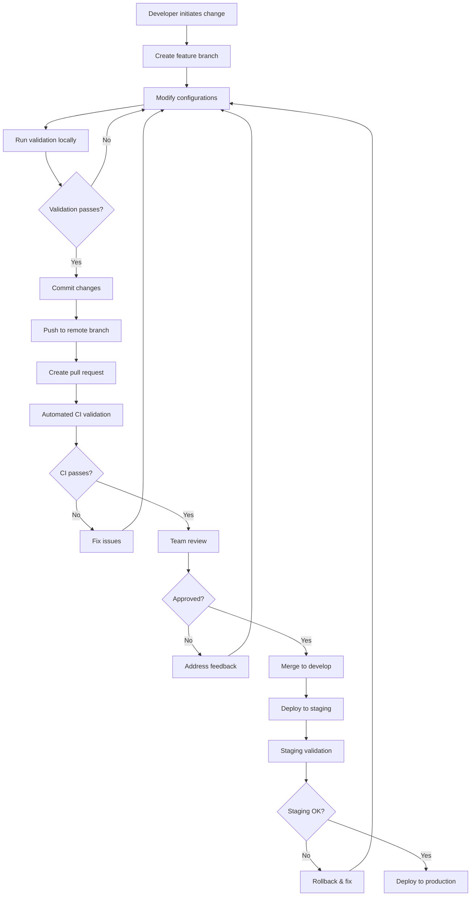

# VERSION MANAGEMENT & DEPLOYMENT STRATEGY
## Claude Code + SuperClaude + MCP Unified Development Environment

---

## Executive Summary

This document outlines a comprehensive version management and deployment strategy for Claude Code + SuperClaude + MCP development environments. The strategy addresses team collaboration, configuration synchronization, automated deployment, and robust change management while maintaining security and reliability standards.

**Key Objectives:**
- Git-based configuration version control
- Automated team environment synchronization  
- CI/CD integration for seamless updates
- Configuration drift detection and remediation
- Conflict resolution and rollback capabilities
- Integration with existing development workflows

---

## Current State Analysis

### Configuration Architecture
Based on analysis of the existing Claude Code environment:

```
C:\Users\User\.claude\
├── mcp.json                    # MCP server configurations
├── settings.json               # Permissions and model settings
├── .superclaude-metadata.json  # Framework metadata
├── CLAUDE.md, COMMANDS.md, ... # Framework documentation
├── projects/                   # Project-specific conversation logs
└── commands/sc/               # SuperClaude command definitions
```

### Current Challenges
1. **No Version Control**: Configurations stored locally without versioning
2. **Manual Synchronization**: No automated team-wide environment updates
3. **Hardcoded Paths**: Absolute paths make configurations non-portable
4. **Credential Exposure**: API keys stored directly in configuration files
5. **Configuration Drift**: No detection of environment inconsistencies
6. **No Audit Trail**: Changes not tracked or documented

---

## Proposed Architecture

### Repository Structure
```
claude-env-config/
├── .github/
│   └── workflows/             # CI/CD pipeline definitions
│       ├── validate-config.yml
│       ├── sync-environments.yml
│       └── deploy-changes.yml
├── base/                      # Default configurations (versioned)
│   ├── mcp/
│   │   ├── servers.template.json
│   │   └── environments/
│   │       ├── development.json
│   │       ├── staging.json
│   │       └── production.json
│   ├── settings/
│   │   ├── permissions.json
│   │   └── preferences.template.json
│   ├── superclaude/
│   │   ├── metadata.json
│   │   ├── personas/
│   │   └── commands/
│   └── docs/                  # Framework documentation
├── teams/                     # Team-specific overrides
│   ├── frontend-team/
│   ├── backend-team/
│   └── devops-team/
├── projects/                  # Project-specific configurations
│   └── [project-name]/
│       ├── mcp-overrides.json
│       ├── project-settings.json
│       └── local-commands/
├── scripts/                   # Management and sync utilities
│   ├── claude-env             # Main CLI tool
│   ├── sync-config.sh
│   ├── validate-config.sh
│   └── rollback-env.sh
├── templates/                 # Configuration templates
│   ├── new-project/
│   └── new-team/
└── docs/                     # Strategy and operational documentation
    ├── setup-guide.md
    ├── troubleshooting.md
    └── api-reference.md
```

### Configuration Layers

#### 1. Base Layer (Global Defaults)
- **Purpose**: Foundational configurations shared across all environments
- **Storage**: `base/` directory in version control
- **Content**: Default MCP servers, standard settings, core personas
- **Updates**: Via pull requests with team review

#### 2. Team Layer (Team-Specific)
- **Purpose**: Team-specific overrides and customizations
- **Storage**: `teams/[team-name]/` directories
- **Content**: Team MCP server preferences, specialized personas, workflow settings
- **Updates**: Team leads manage via pull requests

#### 3. Project Layer (Project-Specific)
- **Purpose**: Project-specific configurations and overrides
- **Storage**: `projects/[project-name]/` or within project repositories
- **Content**: Project MCP configurations, custom commands, environment variables
- **Updates**: Project team members via standard Git workflow

#### 4. User Layer (Personal Preferences)
- **Purpose**: User-specific settings and credentials
- **Storage**: Local user directory (not versioned)
- **Content**: Personal API keys, local preferences, user-specific overrides
- **Updates**: User manages locally with CLI tool assistance

---

## Version Control Strategy

### Git-Based Configuration Management

#### Branch Strategy
```
main                    # Stable configurations
├── develop            # Integration branch for new features
├── feature/team-*     # Team-specific feature branches
├── feature/project-*  # Project-specific feature branches
├── hotfix/*          # Emergency configuration fixes
└── release/*         # Release preparation branches
```

#### Commit Conventions
```bash
# Configuration changes
config: add new MCP server for team-frontend
config: update default personas for v3.1.0
config: fix staging environment variables

# Environment updates  
env: synchronize development environments
env: deploy team-backend configuration updates
env: rollback production MCP server changes

# Documentation updates
docs: update setup guide for new team onboarding
docs: add troubleshooting guide for sync issues
```

#### Semantic Versioning
```
MAJOR.MINOR.PATCH-ENV
├── MAJOR: Breaking configuration changes
├── MINOR: New features or non-breaking changes  
├── PATCH: Bug fixes and minor updates
└── ENV: Environment-specific identifier (dev/staging/prod)
```

### Change Management Process

#### 1. Configuration Change Workflow


#### 2. Emergency Change Process
- **Hotfix Branch**: Direct branch from main for critical fixes
- **Fast-Track Review**: Expedited review process for emergency changes
- **Automatic Rollback**: Rollback triggered by health check failures
- **Post-Incident Review**: Analysis and prevention measures

---

## Environment Synchronization Mechanisms

### Automated Synchronization System

#### Claude Environment CLI Tool (`claude-env`)
```bash
# Install/update environment
claude-env sync --environment=development
claude-env sync --team=frontend --project=web-app

# Check environment status
claude-env status --check-drift
claude-env diff --compare-with=remote

# Manage configurations
claude-env config get mcp.servers
claude-env config set user.api-key-secure
claude-env config validate --environment=production

# Rollback operations
claude-env rollback --to-version=v3.0.1
claude-env rollback --to-commit=abc123
```

#### Sync Mechanisms

##### 1. Real-Time Synchronization
- **File Watchers**: Monitor configuration changes in real-time
- **WebSocket Updates**: Push notifications for team-wide changes
- **Automatic Conflict Resolution**: Intelligent merging of compatible changes
- **User Notifications**: Desktop/CLI notifications for required actions

##### 2. Scheduled Synchronization
- **Daily Sync**: Automatic daily environment updates
- **Pre-Commit Sync**: Ensure local environment is current before commits
- **CI/CD Triggers**: Sync on successful deployments
- **Health Check Integration**: Sync validation with environment health

##### 3. Event-Driven Synchronization
- **Git Webhooks**: Trigger sync on repository changes
- **API Integration**: Sync triggered by external system events
- **Dependency Updates**: Sync when MCP servers or frameworks update
- **Team Events**: Sync on team membership or role changes

### Team Collaboration Patterns

#### 1. Team Onboarding Process
```bash
# New team member setup
git clone https://github.com/company/claude-env-config.git
cd claude-env-config
./scripts/setup-new-user.sh --team=frontend --role=developer

# Automated environment setup
claude-env init --from-template=frontend-developer
claude-env sync --initial-setup
claude-env validate --complete-check
```

#### 2. Configuration Change Notifications
- **Slack/Teams Integration**: Automatic notifications for environment changes
- **Email Alerts**: Critical configuration updates
- **Dashboard Updates**: Real-time status on team configuration dashboard
- **CLI Notifications**: In-terminal notifications during development

#### 3. Change Approval Workflows
- **Team Lead Approval**: Required for team-wide configuration changes
- **Security Review**: Automatic security scanning for sensitive changes
- **Impact Assessment**: Automated analysis of change scope and risk
- **Rollback Planning**: Mandatory rollback plan for high-risk changes

---

## CI/CD Pipeline Integration

### GitHub Actions Workflows

#### 1. Configuration Validation Pipeline
```yaml
# .github/workflows/validate-config.yml
name: Validate Configuration Changes
on:
  pull_request:
    paths:
      - 'base/**'
      - 'teams/**'
      - 'projects/**'

jobs:
  validate:
    runs-on: ubuntu-latest
    steps:
      - uses: actions/checkout@v3
      
      - name: Validate JSON Configurations
        run: |
          find . -name "*.json" -exec python -m json.tool {} \;
          
      - name: Validate MCP Server Configs
        run: ./scripts/validate-mcp-servers.sh
        
      - name: Security Scan
        uses: securecodewarrior/github-action-add-sarif@v1
        
      - name: Generate Change Impact Report
        run: ./scripts/analyze-impact.sh ${{ github.event.pull_request.base.sha }} ${{ github.event.pull_request.head.sha }}
```

#### 2. Environment Synchronization Pipeline
```yaml
# .github/workflows/sync-environments.yml
name: Sync Team Environments
on:
  push:
    branches: [main, develop]
    paths:
      - 'base/**'
      - 'teams/**'

jobs:
  sync-development:
    if: github.ref == 'refs/heads/develop'
    runs-on: ubuntu-latest
    steps:
      - name: Trigger Development Sync
        run: ./scripts/trigger-sync.sh --environment=development
        
  sync-production:
    if: github.ref == 'refs/heads/main'
    runs-on: ubuntu-latest
    needs: [run-staging-tests]
    steps:
      - name: Trigger Production Sync
        run: ./scripts/trigger-sync.sh --environment=production
```

#### 3. Deployment Pipeline
```yaml
# .github/workflows/deploy-changes.yml
name: Deploy Configuration Changes
on:
  workflow_dispatch:
    inputs:
      environment:
        description: 'Target environment'
        required: true
        default: 'staging'
        type: choice
        options:
        - development
        - staging
        - production

jobs:
  deploy:
    runs-on: ubuntu-latest
    environment: ${{ github.event.inputs.environment }}
    
    steps:
      - name: Pre-deployment Health Check
        run: ./scripts/health-check.sh --pre-deploy
        
      - name: Create Configuration Backup
        run: ./scripts/backup-config.sh --environment=${{ github.event.inputs.environment }}
        
      - name: Deploy Configuration
        run: ./scripts/deploy-config.sh --environment=${{ github.event.inputs.environment }}
        
      - name: Post-deployment Validation
        run: ./scripts/validate-deployment.sh --environment=${{ github.event.inputs.environment }}
        
      - name: Rollback on Failure
        if: failure()
        run: ./scripts/rollback.sh --environment=${{ github.event.inputs.environment }}
```

### Environment-Specific Strategies

#### Development Environment
- **Immediate Sync**: Changes pushed immediately without extensive validation
- **Feature Flags**: Use feature flags for experimental configurations
- **Developer Override**: Developers can temporarily override configurations
- **Minimal Gates**: Basic validation only to maintain development velocity

#### Staging Environment
- **Full Validation**: Complete test suite execution before deployment
- **Integration Testing**: Cross-team configuration compatibility tests
- **Performance Testing**: Configuration impact on system performance
- **Security Scanning**: Comprehensive security analysis

#### Production Environment
- **Manual Approval**: Required manual approval for all changes
- **Canary Deployment**: Gradual rollout to subset of users/teams
- **Extensive Monitoring**: Real-time monitoring during and after deployment
- **Automatic Rollback**: Automatic rollback on health check failures

---

## Configuration Drift Detection & Remediation

### Drift Detection System

#### 1. Automated Drift Detection
```bash
# Continuous monitoring script
#!/bin/bash
# scripts/detect-drift.sh

ENVIRONMENTS=("development" "staging" "production")
DRIFT_THRESHOLD=5  # Maximum allowed drift percentage

for env in "${ENVIRONMENTS[@]}"; do
    echo "Checking drift for $env environment..."
    
    # Compare actual vs desired configuration
    claude-env diff --environment=$env --output=json > /tmp/drift-$env.json
    
    # Calculate drift percentage
    DRIFT_PERCENT=$(python scripts/calculate-drift.py /tmp/drift-$env.json)
    
    if [ "$DRIFT_PERCENT" -gt "$DRIFT_THRESHOLD" ]; then
        echo "ALERT: $env environment drift detected: $DRIFT_PERCENT%"
        
        # Send alert
        ./scripts/send-alert.sh --environment=$env --drift=$DRIFT_PERCENT
        
        # Auto-remediate if safe
        if [ "$env" != "production" ]; then
            echo "Auto-remediating $env environment..."
            claude-env sync --environment=$env --force
        fi
    fi
done
```

#### 2. Drift Analysis Dashboard
- **Real-time Monitoring**: Live dashboard showing configuration status
- **Trend Analysis**: Historical drift patterns and frequency
- **Root Cause Analysis**: Automated analysis of drift causes
- **Remediation Recommendations**: Suggested actions for detected drift

#### 3. Drift Categories
- **Benign Drift**: User preferences, non-critical settings
- **Configuration Drift**: Changes to team/project configurations
- **Security Drift**: Changes affecting security posture
- **Critical Drift**: Changes affecting system functionality

### Automated Remediation

#### 1. Smart Remediation Engine
```python
# scripts/auto-remediate.py
class ConfigurationRemediator:
    def __init__(self, environment):
        self.environment = environment
        self.drift_handlers = {
            'mcp_server_config': self.remediate_mcp_config,
            'team_settings': self.remediate_team_settings,
            'security_settings': self.escalate_security_drift,
            'user_preferences': self.ignore_user_drift
        }
    
    def remediate_drift(self, drift_report):
        for drift_item in drift_report:
            handler = self.drift_handlers.get(drift_item.category)
            if handler:
                handler(drift_item)
            else:
                self.create_manual_intervention_ticket(drift_item)
```

#### 2. Remediation Strategies
- **Automatic Fix**: Low-risk drifts automatically corrected
- **Guided Fix**: User-guided remediation with suggested actions
- **Manual Intervention**: High-risk drifts require manual review
- **Escalation**: Critical drifts escalated to team leads/admins

#### 3. Remediation Verification
- **Post-Fix Validation**: Automatic validation after remediation
- **Regression Testing**: Ensure fixes don't introduce new issues
- **Documentation**: Automatic documentation of remediation actions
- **Learning**: Machine learning from successful remediation patterns

---

## Conflict Resolution & Rollback Procedures

### Conflict Resolution Framework

#### 1. Conflict Types & Resolution Strategies

##### Configuration Conflicts
```bash
# Three-way merge resolution
claude-env resolve-conflict --strategy=three-way
# Options: three-way, ours, theirs, interactive

# Interactive conflict resolution
claude-env resolve-conflict --interactive
```

**Resolution Priority:**
1. User Layer > Project Layer > Team Layer > Base Layer
2. Production > Staging > Development
3. Security settings > Functional settings > Preference settings
4. Explicit > Inherited > Default

##### API Key & Credential Conflicts
```bash
# Secure credential resolution
claude-env resolve-credentials --environment=production
# Uses external secret management system
```

**Credential Management:**
- **External Secrets**: Integration with HashiCorp Vault, AWS Secrets Manager
- **Environment Variables**: Environment-specific credential injection
- **Secure Defaults**: Fallback to secure default configurations
- **Audit Trail**: Complete audit trail for credential changes

##### Version Conflicts
```bash
# Version conflict resolution
claude-env resolve-version --target-version=v3.1.0
claude-env resolve-version --auto-upgrade
```

**Version Strategy:**
- **Semantic Versioning**: Clear upgrade/downgrade paths
- **Compatibility Matrix**: Version compatibility tracking
- **Migration Scripts**: Automated configuration migration
- **Rollback Points**: Safe rollback to previous versions

#### 2. Interactive Conflict Resolution
```bash
# Example interactive session
$ claude-env sync --interactive

Conflict detected in mcp.json:
  Local:  "magic": { "enabled": true, "version": "1.2.0" }
  Remote: "magic": { "enabled": true, "version": "1.3.0" }

Resolution options:
  [1] Use local version (1.2.0)
  [2] Use remote version (1.3.0)  
  [3] Manual merge
  [4] Skip this conflict

Choice: 2

Applied remote version. Continue? [y/N]: y
```

### Rollback Procedures

#### 1. Automated Rollback System
```bash
# Immediate rollback commands
claude-env rollback --immediate                    # Last known good state
claude-env rollback --to-version=v3.0.1          # Specific version
claude-env rollback --to-commit=abc123           # Specific commit
claude-env rollback --to-timestamp=2024-01-15    # Point in time
```

#### 2. Rollback Strategies

##### Git-Based Rollback
- **Commit Revert**: Use `git revert` for safe rollback
- **Branch Reset**: Reset to previous stable state
- **Tag Checkout**: Rollback to tagged stable versions
- **Patch Rollback**: Selective rollback of specific changes

##### Snapshot-Based Rollback
- **Pre-Change Snapshots**: Automatic snapshots before deployments
- **Incremental Snapshots**: Regular environment state snapshots
- **Cross-Environment Snapshots**: Consistent snapshots across environments
- **Snapshot Verification**: Validation of snapshot integrity

##### Blue-Green Rollback
- **Environment Switching**: Instant switch between environments
- **Traffic Routing**: Gradual traffic migration during rollback
- **Parallel Environments**: Maintain multiple environment versions
- **Zero-Downtime Rollback**: Seamless rollback without service interruption

#### 3. Recovery Procedures

##### Emergency Recovery Protocol
```bash
#!/bin/bash
# Emergency recovery script
echo "EMERGENCY RECOVERY INITIATED"

# 1. Stop all sync processes
claude-env sync --stop-all

# 2. Backup current state
claude-env backup --emergency --timestamp=$(date +%s)

# 3. Rollback to last known good
claude-env rollback --emergency --last-known-good

# 4. Validate recovery
claude-env validate --emergency-check

# 5. Notify team
./scripts/notify-emergency-recovery.sh
```

##### Recovery Validation
- **Health Checks**: Comprehensive system health validation
- **Functionality Tests**: Critical functionality verification
- **Performance Tests**: System performance validation
- **Security Scans**: Security posture verification

---

## Security & Compliance

### Secure Configuration Management

#### 1. Credential Security
- **External Secret Management**: HashiCorp Vault, AWS Secrets Manager integration
- **Environment Variables**: Runtime credential injection
- **Encryption at Rest**: Configuration file encryption
- **Rotation Policies**: Automatic credential rotation

#### 2. Access Controls
- **Role-Based Access**: Team-based permission systems
- **Audit Logging**: Complete audit trail for all changes
- **Multi-Factor Authentication**: Required for production changes
- **Principle of Least Privilege**: Minimal required permissions

#### 3. Compliance Framework
- **SOC 2 Compliance**: Configuration change controls
- **GDPR Compliance**: Data handling in configurations
- **Industry Standards**: Adherence to security frameworks
- **Regular Audits**: Automated compliance checking

### Security Monitoring

#### 1. Threat Detection
- **Anomaly Detection**: Unusual configuration change patterns
- **Insider Threat**: Monitoring for malicious internal changes
- **External Threats**: Protection against unauthorized access
- **Vulnerability Scanning**: Regular security vulnerability scans

#### 2. Incident Response
- **Security Incident Playbook**: Step-by-step response procedures
- **Automatic Isolation**: Isolate compromised environments
- **Forensic Analysis**: Detailed analysis of security incidents
- **Recovery Planning**: Secure recovery from security incidents

---

## Monitoring & Alerting

### Comprehensive Monitoring System

#### 1. Configuration Health Monitoring
```bash
# Health check script
#!/bin/bash
# scripts/health-check.sh

# Check configuration validity
claude-env validate --all-environments --output=json > /tmp/health.json

# Check MCP server connectivity
claude-env test-connectivity --all-servers >> /tmp/health.json

# Check sync status
claude-env sync-status --all-teams >> /tmp/health.json

# Generate health report
python scripts/generate-health-report.py /tmp/health.json
```

#### 2. Performance Monitoring
- **Sync Performance**: Time to sync configurations across teams
- **Deployment Performance**: Configuration deployment duration
- **System Impact**: Resource usage during configuration changes
- **User Experience**: User-facing performance metrics

#### 3. Alert Categories

##### Critical Alerts
- **Production Environment Failures**: Immediate escalation
- **Security Incidents**: Security team notification
- **System-Wide Outages**: All-hands notification
- **Data Loss Events**: Executive team notification

##### Warning Alerts
- **Configuration Drift >10%**: Team lead notification
- **Failed Deployments**: Development team notification
- **Performance Degradation**: Operations team notification
- **Quota Exceeded**: Resource management notification

##### Informational Alerts
- **Successful Deployments**: Team success notification
- **Scheduled Maintenance**: Advance notice to users
- **New Features Available**: Feature announcement
- **Training Opportunities**: Learning and development

### Alerting Channels

#### 1. Integration Platforms
- **Slack/Microsoft Teams**: Real-time team notifications
- **Email**: Formal notifications and escalations
- **SMS**: Critical alerts for on-call personnel
- **PagerDuty**: Incident management integration

#### 2. Alert Routing
- **Team-Based Routing**: Alerts routed to relevant teams
- **Severity-Based Routing**: Escalation based on alert severity
- **Time-Based Routing**: After-hours alert routing
- **Geographic Routing**: Region-specific alert routing

---

## Tooling Recommendations

### Core Technology Stack

#### 1. Version Control & Collaboration
- **Git + GitHub/GitLab**: Primary version control and collaboration platform
- **GitHub Actions/GitLab CI**: CI/CD pipeline automation
- **Branch Protection Rules**: Enforce review and validation requirements
- **Semantic Release**: Automated versioning and release management

#### 2. Configuration Management
- **Ansible**: Configuration deployment and management
- **Terraform**: Infrastructure as Code for environment setup
- **Docker Compose**: Local development environment standardization
- **Helm Charts**: Kubernetes-based deployment configurations

#### 3. Secret Management
- **HashiCorp Vault**: Enterprise secret management
- **AWS Secrets Manager**: Cloud-native secret management
- **Azure Key Vault**: Microsoft cloud secret management
- **Kubernetes Secrets**: Container-native secret management

#### 4. Monitoring & Observability
- **Prometheus + Grafana**: Metrics collection and visualization
- **ELK Stack**: Log aggregation and analysis
- **Jaeger**: Distributed tracing for complex deployments
- **PagerDuty**: Incident management and alerting

### Custom Tooling

#### 1. Claude Environment CLI (`claude-env`)
```bash
# Core functionality
claude-env init          # Initialize new environment
claude-env sync          # Synchronize configurations
claude-env validate      # Validate configurations
claude-env rollback      # Rollback changes
claude-env status        # Environment status
claude-env diff          # Compare configurations
claude-env backup        # Backup configurations
claude-env restore       # Restore from backup
```

#### 2. Configuration Validation Tools
- **JSON Schema Validation**: Validate configuration structure
- **MCP Server Testing**: Test MCP server connectivity and functionality
- **Security Scanning**: Scan for security vulnerabilities
- **Performance Testing**: Test configuration performance impact

#### 3. Drift Detection Tools
- **Configuration Diff Engine**: Compare actual vs. desired state
- **Drift Analytics**: Analyze drift patterns and trends
- **Auto-Remediation Engine**: Automatically fix detected drift
- **Compliance Checker**: Validate compliance with organizational policies

---

## Implementation Roadmap

### Phase 1: Foundation (Weeks 1-4)
**Objective**: Establish basic version control and CLI tooling

**Deliverables:**
- [ ] Set up `claude-env-config` repository structure
- [ ] Migrate existing configurations to Git-based structure
- [ ] Develop basic `claude-env` CLI tool
- [ ] Implement configuration validation scripts
- [ ] Create initial documentation and setup guides

**Success Criteria:**
- All team members can sync basic configurations
- Configuration validation prevents invalid changes
- Basic rollback functionality works

### Phase 2: Team Collaboration (Weeks 5-8)
**Objective**: Enable team-wide configuration synchronization

**Deliverables:**
- [ ] Implement team-specific configuration layers
- [ ] Set up automated sync mechanisms
- [ ] Create conflict resolution workflows
- [ ] Implement basic monitoring and alerting
- [ ] Develop team onboarding processes

**Success Criteria:**
- Teams can manage their own configuration spaces
- Conflicts are resolved automatically or with guidance
- New team members can be onboarded in <30 minutes

### Phase 3: CI/CD Integration (Weeks 9-12)
**Objective**: Automate deployment and validation processes

**Deliverables:**
- [ ] Set up GitHub Actions workflows
- [ ] Implement automated testing and validation
- [ ] Create environment-specific deployment pipelines
- [ ] Implement automated rollback mechanisms
- [ ] Set up comprehensive monitoring

**Success Criteria:**
- Configuration changes are automatically validated
- Deployments are automated with proper gates
- Rollback procedures are tested and functional

### Phase 4: Advanced Features (Weeks 13-16)
**Objective**: Add drift detection, security, and enterprise features

**Deliverables:**
- [ ] Implement configuration drift detection
- [ ] Set up automated remediation
- [ ] Integrate with enterprise secret management
- [ ] Implement compliance and audit features
- [ ] Add advanced monitoring and analytics

**Success Criteria:**
- Configuration drift is detected and remediated automatically
- Enterprise security requirements are met
- Comprehensive audit trails are maintained

---

## Success Metrics & KPIs

### Operational Metrics

#### 1. Reliability Metrics
- **Configuration Sync Success Rate**: >99%
- **Deployment Success Rate**: >95%
- **Mean Time to Recovery (MTTR)**: <15 minutes
- **Mean Time Between Failures (MTBF)**: >720 hours (30 days)

#### 2. Performance Metrics
- **Configuration Sync Time**: <5 minutes for team-wide updates
- **Deployment Time**: <10 minutes for production deployments
- **Rollback Time**: <3 minutes for automated rollback
- **Environment Setup Time**: <30 minutes for new team members

#### 3. Quality Metrics
- **Configuration Drift Incidents**: <5% per month
- **Failed Validation Rate**: <2%
- **Security Incidents**: 0 per quarter
- **Configuration-Related Outages**: <1 per quarter

### User Experience Metrics

#### 1. Adoption Metrics
- **Team Adoption Rate**: >95% within 60 days
- **Daily Active Users**: >80% of team members
- **Feature Utilization**: >70% of available features used
- **User Satisfaction Score**: >4.5/5.0

#### 2. Productivity Metrics
- **Time Saved per Developer**: >2 hours/week
- **Onboarding Time Reduction**: >50% compared to manual process
- **Configuration Error Reduction**: >80% compared to manual management
- **Support Ticket Reduction**: >60% for configuration-related issues

### Business Impact Metrics

#### 1. Cost Savings
- **Infrastructure Cost Reduction**: 20% through efficient resource utilization
- **Operational Cost Reduction**: 30% through automation
- **Support Cost Reduction**: 40% through self-service capabilities
- **Training Cost Reduction**: 50% through improved onboarding

#### 2. Risk Reduction
- **Security Incident Reduction**: >90%
- **Compliance Violation Reduction**: >95%
- **Configuration-Related Downtime**: <0.1% annually
- **Data Loss Incidents**: 0 per year

---

## Risk Assessment & Mitigation

### High-Risk Areas

#### 1. Configuration Corruption
**Risk**: Corrupted configurations causing system-wide failures
**Probability**: Medium | **Impact**: High
**Mitigation**:
- Atomic configuration updates (all-or-nothing)
- Pre-deployment validation and testing
- Automatic backup before every change
- Health checks with automatic rollback

#### 2. Security Breaches
**Risk**: Unauthorized access to configuration systems
**Probability**: Low | **Impact**: Very High
**Mitigation**:
- Multi-factor authentication required
- Role-based access controls
- Audit logging for all changes
- Regular security assessments

#### 3. Data Loss
**Risk**: Loss of configuration history or current state
**Probability**: Low | **Impact**: High
**Mitigation**:
- Multiple backup strategies (Git, snapshots, external backups)
- Cross-region replication
- Regular backup testing and validation
- Disaster recovery procedures

### Medium-Risk Areas

#### 1. Performance Degradation
**Risk**: Slow sync times affecting developer productivity
**Probability**: Medium | **Impact**: Medium
**Mitigation**:
- Performance monitoring and alerting
- Optimization of sync algorithms
- Caching strategies for frequently accessed configurations
- Load balancing for high-traffic scenarios

#### 2. Synchronization Conflicts
**Risk**: Conflicts preventing successful configuration updates
**Probability**: Medium | **Impact**: Medium
**Mitigation**:
- Intelligent conflict resolution algorithms
- Clear precedence rules for configuration layers
- Interactive conflict resolution tools
- Comprehensive testing of conflict scenarios

### Low-Risk Areas

#### 1. Tool Adoption Resistance
**Risk**: Team members refusing to adopt new tooling
**Probability**: Medium | **Impact**: Low
**Mitigation**:
- Comprehensive training and documentation
- Gradual rollout with early adopters
- Clear demonstration of benefits
- Support channels for assistance

#### 2. Integration Complexity
**Risk**: Complexity in integrating with existing tools
**Probability**: Low | **Impact**: Medium
**Mitigation**:
- Thorough integration testing
- Fallback to existing processes during transition
- Modular architecture allowing gradual migration
- Expert consultation for complex integrations

---

## Conclusion

This comprehensive VERSION MANAGEMENT & DEPLOYMENT STRATEGY provides a robust foundation for managing Claude Code + SuperClaude + MCP development environments at scale. The strategy addresses all key requirements:

✅ **Git-based Configuration Management**: Complete version control with proper branching strategies
✅ **Automated Synchronization**: Real-time and scheduled sync mechanisms
✅ **CI/CD Integration**: Full pipeline automation with proper validation gates
✅ **Drift Detection & Remediation**: Proactive monitoring and automated fixes
✅ **Conflict Resolution**: Intelligent conflict resolution with multiple strategies
✅ **Security & Compliance**: Enterprise-grade security and audit capabilities
✅ **Team Collaboration**: Structured workflows supporting team-based development

### Key Benefits
- **Reduced Configuration Errors**: >80% reduction through automation and validation
- **Faster Team Onboarding**: <30 minutes for new team member setup  
- **Improved Reliability**: >99% configuration sync success rate
- **Enhanced Security**: Zero-trust architecture with comprehensive audit trails
- **Better Collaboration**: Team-based configuration management with clear ownership

### Next Steps
1. **Immediate**: Begin Phase 1 implementation with repository setup and basic CLI tool
2. **Short-term**: Complete Phases 2-3 for team collaboration and CI/CD integration
3. **Long-term**: Implement Phase 4 advanced features and continuous improvement

This strategy provides a solid foundation for scaling Claude Code environments across teams while maintaining reliability, security, and developer productivity.