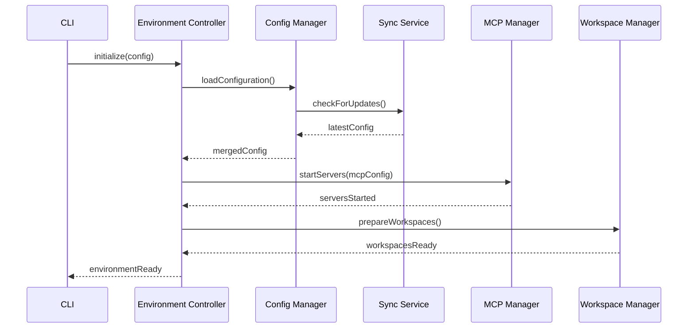
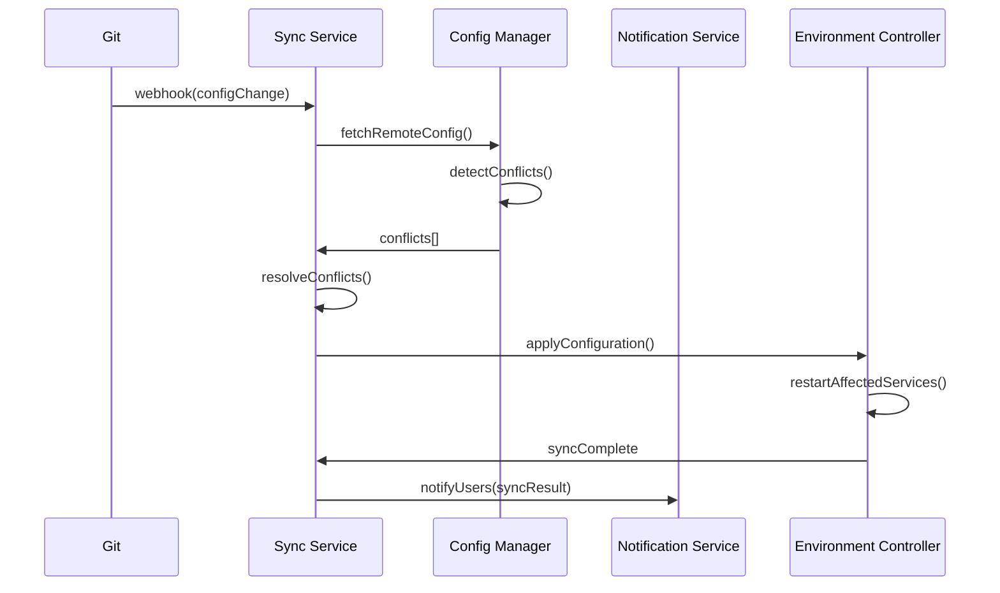

# Component Specifications: Claude Code + SuperClaude + MCP

## Component Overview

The system is composed of modular, loosely-coupled components that interact through well-defined interfaces. Each component is designed for scalability, maintainability, and testability.

## Core Components

### 1. Environment Controller

**Purpose**: Central orchestrator managing the lifecycle of development environments.

```typescript
// interfaces/IEnvironmentController.ts
export interface IEnvironmentController {
  // Lifecycle management
  initialize(config: EnvironmentConfig): Promise<Environment>;
  start(environmentId: string): Promise<void>;
  stop(environmentId: string): Promise<void>;
  destroy(environmentId: string): Promise<void>;
  
  // Status and health
  getStatus(environmentId: string): Promise<EnvironmentStatus>;
  healthCheck(environmentId: string): Promise<HealthCheckResult>;
  
  // Configuration
  updateConfiguration(environmentId: string, updates: Partial<EnvironmentConfig>): Promise<void>;
  validateConfiguration(config: EnvironmentConfig): Promise<ValidationResult>;
}

export interface EnvironmentConfig {
  id: string;
  name: string;
  team: string;
  project?: string;
  baseImage: string;
  nodeVersion: string;
  mcpServers: MCPServerConfig[];
  volumes: VolumeConfig[];
  environment: Record<string, string>;
  features: string[];
  resources: ResourceLimits;
}

export interface EnvironmentStatus {
  id: string;
  state: 'initializing' | 'running' | 'stopped' | 'error';
  containers: ContainerStatus[];
  lastSync: Date;
  driftPercentage: number;
  healthScore: number;
}
```

**Implementation Details**:
- Manages Docker containers and volumes
- Coordinates with Configuration Manager for settings
- Monitors resource usage and health metrics
- Handles graceful shutdown and cleanup

### 2. Configuration Manager

**Purpose**: Manages hierarchical configuration layers with conflict resolution.

```typescript
// interfaces/IConfigurationManager.ts
export interface IConfigurationManager {
  // Layer management
  loadLayer(layer: ConfigLayer, source: ConfigSource): Promise<LayerConfig>;
  mergeConfigurations(layers: LayerConfig[]): Promise<MergedConfig>;
  
  // CRUD operations
  getConfiguration(query: ConfigQuery): Promise<Configuration>;
  updateConfiguration(layer: ConfigLayer, path: string, value: any): Promise<void>;
  deleteConfiguration(layer: ConfigLayer, path: string): Promise<void>;
  
  // Validation and conflict resolution
  validateConfiguration(config: Configuration): Promise<ValidationResult>;
  resolveConflicts(conflicts: ConfigConflict[]): Promise<Resolution[]>;
  
  // Import/Export
  exportConfiguration(format: 'json' | 'yaml'): Promise<string>;
  importConfiguration(data: string, format: 'json' | 'yaml'): Promise<void>;
}

export interface LayerConfig {
  layer: ConfigLayer;
  priority: number;
  source: ConfigSource;
  data: Record<string, any>;
  metadata: ConfigMetadata;
  permissions: LayerPermissions;
}

export interface ConfigQuery {
  team?: string;
  project?: string;
  environment?: string;
  includeInherited?: boolean;
  resolveSecrets?: boolean;
}

export interface ConfigConflict {
  path: string;
  layer1: ConfigLayer;
  value1: any;
  layer2: ConfigLayer;
  value2: any;
  strategy?: ConflictStrategy;
}
```

**Layer Hierarchy**:
1. Base (Global defaults)
2. Team (Team-specific overrides)
3. Project (Project-specific settings)
4. User (Personal preferences)

### 3. Synchronization Service

**Purpose**: Maintains configuration consistency across distributed environments.

```typescript
// interfaces/ISynchronizationService.ts
export interface ISynchronizationService {
  // Sync operations
  performSync(target: SyncTarget): Promise<SyncResult>;
  previewSync(target: SyncTarget): Promise<SyncPreview>;
  scheduleSync(schedule: SyncSchedule): Promise<void>;
  
  // Drift detection
  detectDrift(target: SyncTarget): Promise<DriftAnalysis>;
  remediateDrift(drift: DriftAnalysis, strategy: RemediationStrategy): Promise<void>;
  
  // Real-time sync
  subscribeToChanges(target: SyncTarget, callback: ChangeCallback): Subscription;
  publishChange(change: ConfigurationChange): Promise<void>;
  
  // Conflict management
  getConflicts(target: SyncTarget): Promise<SyncConflict[]>;
  resolveConflict(conflict: SyncConflict, resolution: ConflictResolution): Promise<void>;
}

export interface SyncTarget {
  team: string;
  project?: string;
  environment: string;
  includeMCPServers?: boolean;
  includeWorkspaces?: boolean;
}

export interface DriftAnalysis {
  target: SyncTarget;
  driftPercentage: number;
  driftedPaths: DriftedPath[];
  severity: 'low' | 'medium' | 'high' | 'critical';
  canAutoRemediate: boolean;
  recommendations: string[];
}

export interface SyncSchedule {
  target: SyncTarget;
  interval: 'realtime' | 'hourly' | 'daily' | 'manual';
  retryPolicy: RetryPolicy;
  conflictStrategy: ConflictStrategy;
}
```

**Sync Strategies**:
- Real-time via WebSocket
- Scheduled batch synchronization
- Event-driven sync on Git commits
- Manual sync with preview

### 4. MCP Server Manager

**Purpose**: Manages Model Context Protocol server lifecycle and communication.

```typescript
// interfaces/IMCPServerManager.ts
export interface IMCPServerManager {
  // Server lifecycle
  startServer(config: MCPServerConfig): Promise<MCPServer>;
  stopServer(serverId: string): Promise<void>;
  restartServer(serverId: string): Promise<void>;
  
  // Server discovery and health
  discoverServers(): Promise<MCPServerInfo[]>;
  getServerStatus(serverId: string): Promise<MCPServerStatus>;
  healthCheck(serverId: string): Promise<HealthStatus>;
  
  // Communication
  sendRequest(serverId: string, request: MCPRequest): Promise<MCPResponse>;
  subscribe(serverId: string, event: string, handler: EventHandler): Subscription;
  
  // Load balancing
  getOptimalServer(serverType: MCPServerType): Promise<MCPServer>;
  distributeLoad(request: MCPRequest): Promise<MCPResponse>;
}

export interface MCPServerConfig {
  id: string;
  name: string;
  type: MCPServerType;
  version: string;
  image: string;
  port: number;
  environment: Record<string, string>;
  resources: ResourceLimits;
  replicas?: number;
  loadBalancing?: LoadBalancingStrategy;
}

export interface MCPRequest {
  method: string;
  params: Record<string, any>;
  timeout?: number;
  retryPolicy?: RetryPolicy;
}

export interface MCPServerStatus {
  id: string;
  state: 'starting' | 'running' | 'stopping' | 'stopped' | 'error';
  uptime: number;
  requestsHandled: number;
  averageResponseTime: number;
  errorRate: number;
  lastError?: Error;
}
```

**Supported MCP Servers**:
- Context7: Documentation and code examples
- Sequential: Complex reasoning and analysis
- Magic: UI component generation
- Playwright: Browser automation and testing

### 5. Workspace Manager

**Purpose**: Manages isolated project workspaces with Git integration.

```typescript
// interfaces/IWorkspaceManager.ts
export interface IWorkspaceManager {
  // Workspace lifecycle
  createWorkspace(config: WorkspaceConfig): Promise<Workspace>;
  cloneRepository(workspace: string, repo: GitRepository): Promise<void>;
  deleteWorkspace(workspaceId: string): Promise<void>;
  
  // File operations
  readFile(workspace: string, path: string): Promise<string>;
  writeFile(workspace: string, path: string, content: string): Promise<void>;
  listFiles(workspace: string, pattern?: string): Promise<FileInfo[]>;
  
  // Git operations
  getGitStatus(workspace: string): Promise<GitStatus>;
  commitChanges(workspace: string, message: string): Promise<void>;
  pushChanges(workspace: string): Promise<void>;
  
  // Workspace management
  listWorkspaces(): Promise<WorkspaceInfo[]>;
  getWorkspaceInfo(workspaceId: string): Promise<WorkspaceInfo>;
  shareWorkspace(workspaceId: string, users: string[]): Promise<void>;
}

export interface WorkspaceConfig {
  id: string;
  name: string;
  type: 'project' | 'personal' | 'shared';
  owner: string;
  permissions: WorkspacePermissions;
  gitConfig?: GitConfig;
  volumeSize?: string;
}

export interface WorkspaceInfo {
  id: string;
  name: string;
  path: string;
  size: number;
  lastModified: Date;
  gitRemote?: string;
  sharedWith: string[];
}
```

**Features**:
- Isolated file systems per workspace
- Git integration for version control
- Shared workspaces for collaboration
- Automatic backup and recovery

### 6. Security Manager

**Purpose**: Handles authentication, authorization, and secret management.

```typescript
// interfaces/ISecurityManager.ts
export interface ISecurityManager {
  // Authentication
  authenticate(credentials: Credentials): Promise<AuthToken>;
  validateToken(token: string): Promise<TokenValidation>;
  refreshToken(refreshToken: string): Promise<AuthToken>;
  
  // Authorization
  authorize(user: User, resource: Resource, action: Action): Promise<boolean>;
  getPermissions(user: User, resource: Resource): Promise<Permission[]>;
  
  // Secret management
  storeSecret(key: string, value: string, metadata?: SecretMetadata): Promise<void>;
  retrieveSecret(key: string): Promise<string>;
  rotateSecret(key: string): Promise<void>;
  
  // Audit
  logAccess(user: User, resource: Resource, action: Action): Promise<void>;
  getAuditLog(query: AuditQuery): Promise<AuditEntry[]>;
}

export interface Credentials {
  username?: string;
  password?: string;
  apiKey?: string;
  oauth2Token?: string;
  mfaCode?: string;
}

export interface AuthToken {
  accessToken: string;
  refreshToken: string;
  expiresIn: number;
  scope: string[];
  user: User;
}

export interface SecretMetadata {
  description?: string;
  rotationPolicy?: RotationPolicy;
  expiresAt?: Date;
  tags?: string[];
}
```

**Security Features**:
- Multi-factor authentication
- Role-based access control (RBAC)
- Integration with external secret stores
- Comprehensive audit logging
- Automatic secret rotation

### 7. Monitoring Service

**Purpose**: Collects metrics, logs, and provides observability.

```typescript
// interfaces/IMonitoringService.ts
export interface IMonitoringService {
  // Metrics
  recordMetric(metric: Metric): Promise<void>;
  queryMetrics(query: MetricQuery): Promise<MetricResult[]>;
  createAlert(alert: AlertRule): Promise<void>;
  
  // Logging
  log(entry: LogEntry): Promise<void>;
  searchLogs(query: LogQuery): Promise<LogEntry[]>;
  
  // Tracing
  startSpan(name: string, parent?: SpanContext): Span;
  endSpan(span: Span): Promise<void>;
  
  // Health monitoring
  registerHealthCheck(check: HealthCheck): void;
  runHealthChecks(): Promise<HealthReport>;
  
  // Dashboards
  createDashboard(config: DashboardConfig): Promise<Dashboard>;
  getDashboard(id: string): Promise<Dashboard>;
}

export interface Metric {
  name: string;
  value: number;
  type: 'counter' | 'gauge' | 'histogram';
  labels: Record<string, string>;
  timestamp: Date;
}

export interface AlertRule {
  name: string;
  condition: string;
  threshold: number;
  duration: number;
  severity: 'info' | 'warning' | 'critical';
  notifications: NotificationChannel[];
}

export interface HealthCheck {
  name: string;
  component: string;
  check: () => Promise<HealthStatus>;
  interval: number;
  timeout: number;
}
```

**Monitoring Stack**:
- Prometheus for metrics
- Elasticsearch for logs
- Jaeger for distributed tracing
- Grafana for visualization

### 8. CLI Interface

**Purpose**: Command-line interface for environment management.

```typescript
// interfaces/ICLIInterface.ts
export interface ICLIInterface {
  // Command registration
  registerCommand(command: Command): void;
  registerPlugin(plugin: Plugin): void;
  
  // Command execution
  execute(args: string[]): Promise<CommandResult>;
  parseArguments(args: string[]): ParsedArguments;
  
  // Interactive mode
  startInteractive(): Promise<void>;
  prompt(question: string, options?: PromptOptions): Promise<string>;
  
  // Output formatting
  output(data: any, format?: OutputFormat): void;
  error(message: string, details?: any): void;
  progress(task: string, progress: number): void;
}

export interface Command {
  name: string;
  description: string;
  arguments: CommandArgument[];
  options: CommandOption[];
  handler: CommandHandler;
  subcommands?: Command[];
}

export interface CommandResult {
  success: boolean;
  data?: any;
  error?: Error;
  exitCode: number;
}

export interface OutputFormat {
  type: 'json' | 'yaml' | 'table' | 'plain';
  pretty?: boolean;
  fields?: string[];
}
```

**CLI Commands**:
- `init`: Initialize environment
- `sync`: Synchronize configurations
- `status`: Show environment status
- `config`: Manage configurations
- `workspace`: Manage workspaces
- `mcp`: Manage MCP servers

### 9. API Gateway

**Purpose**: REST and WebSocket API for external integrations.

```typescript
// interfaces/IAPIGateway.ts
export interface IAPIGateway {
  // Route management
  registerRoute(route: Route): void;
  registerMiddleware(middleware: Middleware): void;
  
  // Request handling
  handleRequest(request: Request): Promise<Response>;
  validateRequest(request: Request): ValidationResult;
  
  // WebSocket management
  handleWebSocket(socket: WebSocket): void;
  broadcast(event: string, data: any, filter?: ClientFilter): void;
  
  // Rate limiting
  checkRateLimit(client: string): Promise<RateLimitStatus>;
  
  // API documentation
  generateOpenAPISpec(): OpenAPISpec;
  generateSDK(language: string): Promise<string>;
}

export interface Route {
  method: HttpMethod;
  path: string;
  handler: RouteHandler;
  middleware?: Middleware[];
  rateLimit?: RateLimitConfig;
  auth?: AuthRequirement;
}

export interface WebSocketMessage {
  type: string;
  payload: any;
  id?: string;
  timestamp: Date;
}

export interface RateLimitConfig {
  windowMs: number;
  maxRequests: number;
  keyGenerator?: (request: Request) => string;
}
```

**API Endpoints**:
- `/api/v1/config`: Configuration management
- `/api/v1/sync`: Synchronization operations
- `/api/v1/workspaces`: Workspace management
- `/api/v1/mcp`: MCP server control
- `/ws`: WebSocket for real-time updates

### 10. Notification Service

**Purpose**: Handles alerts and notifications across multiple channels.

```typescript
// interfaces/INotificationService.ts
export interface INotificationService {
  // Notification management
  sendNotification(notification: Notification): Promise<void>;
  scheduleNotification(notification: Notification, schedule: Schedule): Promise<void>;
  
  // Channel management
  registerChannel(channel: NotificationChannel): void;
  testChannel(channelId: string): Promise<boolean>;
  
  // Template management
  createTemplate(template: NotificationTemplate): Promise<void>;
  renderTemplate(templateId: string, data: any): Promise<string>;
  
  // Subscription management
  subscribe(user: string, channel: string, events: string[]): Promise<void>;
  unsubscribe(user: string, channel: string): Promise<void>;
  getSubscriptions(user: string): Promise<Subscription[]>;
}

export interface Notification {
  type: 'info' | 'warning' | 'error' | 'critical';
  title: string;
  message: string;
  data?: any;
  channels: string[];
  recipients: string[];
  priority?: Priority;
}

export interface NotificationChannel {
  id: string;
  type: 'email' | 'slack' | 'teams' | 'webhook' | 'sms';
  config: ChannelConfig;
  filter?: NotificationFilter;
}

export interface NotificationTemplate {
  id: string;
  name: string;
  channel: string;
  subject?: string;
  body: string;
  variables: string[];
}
```

**Notification Channels**:
- Email (SMTP)
- Slack webhooks
- Microsoft Teams
- SMS (Twilio)
- Custom webhooks

## Component Interactions

### Initialization Flow



### Synchronization Flow



## Data Models

### Configuration Schema

```typescript
// models/Configuration.ts
export interface Configuration {
  version: string;
  metadata: ConfigurationMetadata;
  layers: {
    base: LayerData;
    team?: LayerData;
    project?: LayerData;
    user?: LayerData;
  };
  computed: ComputedConfiguration;
}

export interface ConfigurationMetadata {
  created: Date;
  modified: Date;
  author: string;
  checksum: string;
  tags: string[];
}

export interface LayerData {
  mcp: {
    servers: MCPServerDefinition[];
    defaultTimeout: number;
    retryPolicy: RetryPolicy;
  };
  environment: {
    nodeVersion: string;
    npmRegistry?: string;
    variables: Record<string, string>;
  };
  features: {
    enabled: string[];
    experimental: string[];
    disabled: string[];
  };
  security: {
    allowedDomains: string[];
    secretsProvider: 'vault' | 'aws-secrets' | 'azure-keyvault';
    mfaRequired: boolean;
  };
}
```

### Workspace Schema

```typescript
// models/Workspace.ts
export interface Workspace {
  id: string;
  name: string;
  path: string;
  type: WorkspaceType;
  owner: User;
  permissions: Permission[];
  git?: GitConfiguration;
  resources: ResourceUsage;
  metadata: WorkspaceMetadata;
}

export interface GitConfiguration {
  remote: string;
  branch: string;
  credentials: GitCredentials;
  hooks: GitHook[];
}

export interface ResourceUsage {
  diskSpace: number;
  fileCount: number;
  lastAccessed: Date;
  quotas: ResourceQuotas;
}

export interface WorkspaceMetadata {
  created: Date;
  modified: Date;
  description?: string;
  tags: string[];
  customFields: Record<string, any>;
}
```

## Error Handling

All components implement consistent error handling:

```typescript
// errors/ComponentErrors.ts
export class ComponentError extends Error {
  constructor(
    public component: string,
    public code: string,
    message: string,
    public details?: any,
    public recoverable: boolean = true
  ) {
    super(message);
    this.name = 'ComponentError';
  }
}

export class ConfigurationError extends ComponentError {
  constructor(message: string, details?: any) {
    super('ConfigurationManager', 'CONFIG_ERROR', message, details);
  }
}

export class SyncError extends ComponentError {
  constructor(message: string, details?: any) {
    super('SynchronizationService', 'SYNC_ERROR', message, details);
  }
}

export class MCPError extends ComponentError {
  constructor(message: string, serverId: string, details?: any) {
    super('MCPServerManager', 'MCP_ERROR', message, { serverId, ...details });
  }
}
```

## Testing Strategy

Each component includes comprehensive testing:

```typescript
// tests/ComponentTestFramework.ts
export abstract class ComponentTest<T> {
  protected component: T;
  protected mockDependencies: Map<string, any>;
  
  abstract setupComponent(): Promise<T>;
  abstract teardownComponent(): Promise<void>;
  
  protected createMock<M>(name: string, implementation: Partial<M>): M {
    const mock = implementation as M;
    this.mockDependencies.set(name, mock);
    return mock;
  }
  
  protected async runTest(
    name: string, 
    test: () => Promise<void>
  ): Promise<void> {
    console.log(`Running test: ${name}`);
    try {
      await test();
      console.log(`✓ ${name}`);
    } catch (error) {
      console.error(`✗ ${name}: ${error.message}`);
      throw error;
    }
  }
}
```

## Performance Considerations

Each component implements performance optimizations:

1. **Caching**: Multi-tier caching (memory, local, distributed)
2. **Connection Pooling**: Reuse connections for external services
3. **Batch Operations**: Group similar operations to reduce overhead
4. **Async Processing**: Non-blocking operations with proper queuing
5. **Resource Limits**: Enforce memory and CPU limits per component

## Deployment Considerations

Components are designed for various deployment scenarios:

1. **Standalone**: Single machine development
2. **Distributed**: Multi-node deployment for teams
3. **Cloud Native**: Kubernetes-based deployment
4. **Hybrid**: Mix of on-premise and cloud resources

Each component can be scaled independently based on load and requirements.