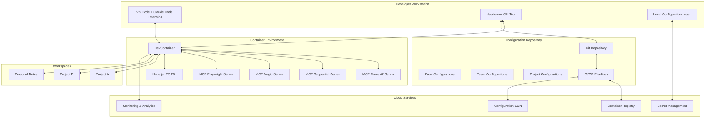

# System Architecture: Claude Code + SuperClaude + MCP Unified Development Environment

## Architecture Overview

The Claude Code + SuperClaude + MCP unified development environment is designed as a containerized, Git-synchronized, multi-layered configuration management system that ensures consistent AI-powered development experiences across distributed teams.

### High-Level Architecture Diagram



## Core Components

### 1. DevContainer Environment Manager

The DevContainer serves as the primary runtime environment, providing OS-agnostic, isolated workspaces.

```typescript
// src/core/devcontainer-manager.ts
export interface DevContainerConfig {
  version: string;
  baseImage: string;
  features: string[];
  mounts: VolumeMount[];
  environment: EnvironmentVariables;
  postCreateCommand?: string;
  postStartCommand?: string;
}

export class DevContainerManager {
  private config: DevContainerConfig;
  private docker: DockerClient;
  
  constructor(config: DevContainerConfig) {
    this.config = config;
    this.docker = new DockerClient();
  }
  
  async initialize(): Promise<ContainerInstance> {
    // Validate Docker availability
    await this.docker.validateInstallation();
    
    // Build or pull container image
    const image = await this.prepareImage();
    
    // Create container with proper configuration
    const container = await this.docker.createContainer({
      image,
      volumes: this.config.mounts,
      environment: this.config.environment,
      network: 'mcp-network',
      labels: {
        'claude-env': 'true',
        'version': this.config.version
      }
    });
    
    // Start container and run post-create commands
    await container.start();
    await this.runPostCreateCommands(container);
    
    return container;
  }
  
  private async prepareImage(): Promise<string> {
    const imageName = `claude-env:${this.config.version}`;
    
    // Check if image exists locally
    if (await this.docker.imageExists(imageName)) {
      return imageName;
    }
    
    // Pull from registry or build locally
    if (this.config.baseImage.startsWith('registry://')) {
      return await this.docker.pullImage(this.config.baseImage);
    } else {
      return await this.docker.buildImage({
        dockerfile: './Dockerfile.dev',
        context: '.',
        tags: [imageName]
      });
    }
  }
}
```

### 2. Configuration Layer System

The configuration system implements a hierarchical layer structure with intelligent merging and conflict resolution.

```typescript
// src/core/config-layers.ts
export enum ConfigLayer {
  BASE = 'base',
  TEAM = 'team',
  PROJECT = 'project',
  USER = 'user'
}

export interface LayerConfig {
  layer: ConfigLayer;
  priority: number;
  source: ConfigSource;
  data: Record<string, any>;
  metadata: ConfigMetadata;
}

export class ConfigurationLayerManager {
  private layers: Map<ConfigLayer, LayerConfig> = new Map();
  private mergeStrategy: MergeStrategy;
  
  constructor(mergeStrategy: MergeStrategy = new SmartMergeStrategy()) {
    this.mergeStrategy = mergeStrategy;
  }
  
  async loadConfiguration(): Promise<MergedConfig> {
    // Load configurations in priority order
    await this.loadBaseLayer();
    await this.loadTeamLayer();
    await this.loadProjectLayer();
    await this.loadUserLayer();
    
    // Merge configurations respecting priority
    return this.mergeConfigurations();
  }
  
  private async loadBaseLayer(): Promise<void> {
    const baseConfig = await this.fetchFromGit('base/');
    this.layers.set(ConfigLayer.BASE, {
      layer: ConfigLayer.BASE,
      priority: 1,
      source: { type: 'git', path: 'base/' },
      data: baseConfig,
      metadata: { 
        version: baseConfig.version,
        lastModified: new Date()
      }
    });
  }
  
  private mergeConfigurations(): MergedConfig {
    const sortedLayers = Array.from(this.layers.values())
      .sort((a, b) => a.priority - b.priority);
    
    let merged = {};
    for (const layer of sortedLayers) {
      merged = this.mergeStrategy.merge(merged, layer.data, layer.layer);
    }
    
    return {
      config: merged,
      sources: sortedLayers.map(l => l.source),
      timestamp: new Date()
    };
  }
}

// Smart merge strategy with conflict resolution
export class SmartMergeStrategy implements MergeStrategy {
  merge(base: any, overlay: any, layer: ConfigLayer): any {
    return this.deepMerge(base, overlay, {
      arrayStrategy: this.getArrayStrategy(layer),
      conflictResolver: this.getConflictResolver(layer)
    });
  }
  
  private getArrayStrategy(layer: ConfigLayer): ArrayMergeStrategy {
    // Different strategies for different configuration types
    return {
      mcp_servers: 'union',        // Combine all servers
      permissions: 'replace',      // Higher layer replaces
      features: 'union',          // Combine features
      environment: 'merge'        // Merge environment variables
    };
  }
}
```

### 3. MCP Server Orchestrator

The MCP Server Orchestrator manages the lifecycle and communication with Model Context Protocol servers.

```typescript
// src/core/mcp-orchestrator.ts
export interface MCPServer {
  name: string;
  type: 'context7' | 'sequential' | 'magic' | 'playwright';
  endpoint: string;
  config: MCPServerConfig;
  status: 'running' | 'stopped' | 'error';
}

export class MCPOrchestrator {
  private servers: Map<string, MCPServer> = new Map();
  private docker: DockerClient;
  private networkManager: NetworkManager;
  
  constructor() {
    this.docker = new DockerClient();
    this.networkManager = new NetworkManager('mcp-network');
  }
  
  async initializeServers(config: MCPConfig): Promise<void> {
    // Create isolated network for MCP servers
    await this.networkManager.createNetwork();
    
    // Start each configured MCP server
    for (const serverConfig of config.servers) {
      await this.startServer(serverConfig);
    }
    
    // Validate all servers are healthy
    await this.healthCheck();
  }
  
  private async startServer(config: MCPServerConfig): Promise<void> {
    const containerName = `mcp-${config.name}`;
    
    // Check if server is already running
    if (await this.docker.containerExists(containerName)) {
      console.log(`MCP server ${config.name} already running`);
      return;
    }
    
    // Start server container
    const container = await this.docker.createContainer({
      name: containerName,
      image: `mcp/${config.type}:${config.version || 'latest'}`,
      network: 'mcp-network',
      environment: {
        ...config.environment,
        MCP_SERVER_NAME: config.name,
        MCP_SERVER_PORT: config.port || 3000
      },
      labels: {
        'mcp-server': 'true',
        'mcp-type': config.type
      }
    });
    
    await container.start();
    
    // Register server
    this.servers.set(config.name, {
      name: config.name,
      type: config.type,
      endpoint: `http://${containerName}:${config.port || 3000}`,
      config,
      status: 'running'
    });
  }
  
  async executeCommand(
    serverName: string, 
    command: string, 
    params: any
  ): Promise<MCPResponse> {
    const server = this.servers.get(serverName);
    if (!server || server.status !== 'running') {
      throw new Error(`MCP server ${serverName} not available`);
    }
    
    try {
      const response = await fetch(`${server.endpoint}/execute`, {
        method: 'POST',
        headers: { 'Content-Type': 'application/json' },
        body: JSON.stringify({ command, params })
      });
      
      return await response.json();
    } catch (error) {
      // Implement retry logic and fallback
      return this.handleServerError(server, error);
    }
  }
}
```

### 4. Synchronization Engine

The synchronization engine ensures configuration consistency across team environments.

```typescript
// src/core/sync-engine.ts
export class SynchronizationEngine {
  private configManager: ConfigurationLayerManager;
  private gitClient: GitClient;
  private driftDetector: DriftDetector;
  private eventBus: EventBus;
  
  constructor(config: SyncConfig) {
    this.configManager = new ConfigurationLayerManager();
    this.gitClient = new GitClient(config.repository);
    this.driftDetector = new DriftDetector();
    this.eventBus = new EventBus();
  }
  
  async startSync(): Promise<void> {
    // Initialize watchers
    this.setupFileWatchers();
    this.setupGitHooks();
    this.setupWebSocketConnection();
    
    // Perform initial sync
    await this.performSync();
    
    // Schedule periodic sync
    setInterval(() => this.performSync(), 5 * 60 * 1000); // 5 minutes
  }
  
  private async performSync(): Promise<SyncResult> {
    try {
      // Fetch latest configurations
      const remoteConfig = await this.gitClient.fetchLatest();
      const localConfig = await this.configManager.loadConfiguration();
      
      // Detect drift
      const drift = await this.driftDetector.analyze(
        localConfig, 
        remoteConfig
      );
      
      if (drift.percentage > 5) {
        // Significant drift detected
        await this.handleDrift(drift);
      }
      
      // Apply updates
      const updates = await this.applyUpdates(remoteConfig);
      
      // Notify subscribers
      this.eventBus.emit('sync:completed', {
        drift,
        updates,
        timestamp: new Date()
      });
      
      return { success: true, updates };
    } catch (error) {
      return this.handleSyncError(error);
    }
  }
  
  private async handleDrift(drift: DriftAnalysis): Promise<void> {
    if (drift.severity === 'critical') {
      // Alert team leads for critical drift
      await this.notifyTeamLeads(drift);
    } else if (drift.canAutoRemediate) {
      // Attempt automatic remediation
      await this.autoRemediate(drift);
    } else {
      // Log for manual review
      await this.logDriftForReview(drift);
    }
  }
}
```

### 5. CLI Tool Implementation

The claude-env CLI provides the primary interface for developers.

```typescript
// src/cli/claude-env.ts
import { Command } from 'commander';
import { DevContainerManager } from '../core/devcontainer-manager';
import { SynchronizationEngine } from '../core/sync-engine';
import { ConfigurationLayerManager } from '../core/config-layers';

export class ClaudeEnvCLI {
  private program: Command;
  private containerManager: DevContainerManager;
  private syncEngine: SynchronizationEngine;
  private configManager: ConfigurationLayerManager;
  
  constructor() {
    this.program = new Command();
    this.setupCommands();
  }
  
  private setupCommands(): void {
    this.program
      .name('claude-env')
      .description('Claude Code unified development environment manager')
      .version('1.0.0');
    
    // Sync command
    this.program
      .command('sync')
      .description('Synchronize environment configurations')
      .option('--force', 'Force sync even with conflicts')
      .option('--dry-run', 'Show what would be synced')
      .action(async (options) => {
        await this.handleSync(options);
      });
    
    // Init command
    this.program
      .command('init')
      .description('Initialize new Claude environment')
      .option('--team <team>', 'Team name')
      .option('--project <project>', 'Project name')
      .action(async (options) => {
        await this.handleInit(options);
      });
    
    // Status command
    this.program
      .command('status')
      .description('Show environment status')
      .option('--check-drift', 'Check for configuration drift')
      .action(async (options) => {
        await this.handleStatus(options);
      });
  }
  
  private async handleSync(options: any): Promise<void> {
    console.log('🔄 Synchronizing environment...');
    
    if (options.dryRun) {
      const changes = await this.syncEngine.previewChanges();
      console.log('Changes to be applied:', changes);
      return;
    }
    
    const result = await this.syncEngine.performSync();
    if (result.success) {
      console.log('✅ Synchronization completed successfully');
      console.log(`Updated: ${result.updates.length} configurations`);
    } else {
      console.error('❌ Synchronization failed:', result.error);
      process.exit(1);
    }
  }
}

// Entry point
if (require.main === module) {
  const cli = new ClaudeEnvCLI();
  cli.run(process.argv);
}
```

## API Design

### REST API for Configuration Management

```typescript
// src/api/config-api.ts
import { Router } from 'express';
import { ConfigurationService } from '../services/configuration-service';
import { authenticate } from '../middleware/auth';

export class ConfigurationAPI {
  private router: Router;
  private configService: ConfigurationService;
  
  constructor() {
    this.router = Router();
    this.configService = new ConfigurationService();
    this.setupRoutes();
  }
  
  private setupRoutes(): void {
    // Get current configuration
    this.router.get('/config', authenticate, async (req, res) => {
      const config = await this.configService.getConfig({
        team: req.user.team,
        project: req.query.project,
        environment: req.query.environment || 'development'
      });
      
      res.json({
        success: true,
        data: config,
        timestamp: new Date()
      });
    });
    
    // Update configuration
    this.router.put('/config/:layer', authenticate, async (req, res) => {
      const { layer } = req.params;
      const updates = req.body;
      
      try {
        const result = await this.configService.updateConfig(
          layer,
          updates,
          req.user
        );
        
        res.json({
          success: true,
          data: result,
          message: 'Configuration updated successfully'
        });
      } catch (error) {
        res.status(400).json({
          success: false,
          error: error.message
        });
      }
    });
    
    // Get drift analysis
    this.router.get('/drift', authenticate, async (req, res) => {
      const drift = await this.configService.analyzeDrift({
        team: req.user.team,
        includeDetails: req.query.details === 'true'
      });
      
      res.json({
        success: true,
        data: drift,
        recommendations: drift.recommendations
      });
    });
  }
  
  getRouter(): Router {
    return this.router;
  }
}
```

### WebSocket API for Real-time Sync

```typescript
// src/api/websocket-api.ts
import { Server } from 'socket.io';
import { SyncEventEmitter } from '../events/sync-events';

export class WebSocketAPI {
  private io: Server;
  private syncEvents: SyncEventEmitter;
  
  constructor(httpServer: any) {
    this.io = new Server(httpServer, {
      cors: {
        origin: process.env.ALLOWED_ORIGINS?.split(',') || ['*']
      }
    });
    
    this.syncEvents = new SyncEventEmitter();
    this.setupHandlers();
  }
  
  private setupHandlers(): void {
    this.io.on('connection', (socket) => {
      console.log(`Client connected: ${socket.id}`);
      
      // Subscribe to sync events
      socket.on('subscribe:sync', (data) => {
        const { team, project } = data;
        socket.join(`sync:${team}:${project || 'all'}`);
        
        // Send current sync status
        socket.emit('sync:status', {
          status: 'connected',
          lastSync: this.syncEvents.getLastSync(team, project)
        });
      });
      
      // Handle manual sync requests
      socket.on('sync:request', async (data) => {
        const result = await this.handleSyncRequest(data);
        socket.emit('sync:result', result);
      });
      
      // Broadcast sync events
      this.syncEvents.on('sync:started', (event) => {
        this.io.to(`sync:${event.team}:${event.project || 'all'}`)
          .emit('sync:started', event);
      });
      
      this.syncEvents.on('sync:completed', (event) => {
        this.io.to(`sync:${event.team}:${event.project || 'all'}`)
          .emit('sync:completed', event);
      });
      
      socket.on('disconnect', () => {
        console.log(`Client disconnected: ${socket.id}`);
      });
    });
  }
}
```

## Deployment Architecture

### Container Registry Structure

```yaml
# docker-compose.yml
version: '3.8'

services:
  devcontainer:
    build:
      context: .
      dockerfile: Dockerfile.dev
    image: claude-env:latest
    container_name: claude-env-dev
    volumes:
      - ./workspaces:/workspaces:cached
      - ~/.claude:/home/vscode/.claude:cached
      - /var/run/docker.sock:/var/run/docker.sock
    environment:
      - NODE_ENV=development
      - CLAUDE_ENV_VERSION=${VERSION}
    networks:
      - claude-network
    depends_on:
      - mcp-context7
      - mcp-sequential
      - mcp-magic
      - mcp-playwright

  mcp-context7:
    image: ghcr.io/claude-env/mcp-context7:latest
    container_name: mcp-context7
    environment:
      - MCP_SERVER_TYPE=context7
      - MCP_PORT=3001
    networks:
      - claude-network
    restart: unless-stopped

  mcp-sequential:
    image: ghcr.io/claude-env/mcp-sequential:latest
    container_name: mcp-sequential
    environment:
      - MCP_SERVER_TYPE=sequential
      - MCP_PORT=3002
    networks:
      - claude-network
    restart: unless-stopped

  mcp-magic:
    image: ghcr.io/claude-env/mcp-magic:latest
    container_name: mcp-magic
    environment:
      - MCP_SERVER_TYPE=magic
      - MCP_PORT=3003
    networks:
      - claude-network
    restart: unless-stopped

  mcp-playwright:
    image: ghcr.io/claude-env/mcp-playwright:latest
    container_name: mcp-playwright
    environment:
      - MCP_SERVER_TYPE=playwright
      - MCP_PORT=3004
    networks:
      - claude-network
    volumes:
      - /tmp/.X11-unix:/tmp/.X11-unix:ro
    restart: unless-stopped

  config-sync:
    image: ghcr.io/claude-env/config-sync:latest
    container_name: config-sync
    environment:
      - SYNC_INTERVAL=300
      - GIT_REPO=${CONFIG_REPO}
    networks:
      - claude-network
    volumes:
      - ./config:/config
    restart: unless-stopped

networks:
  claude-network:
    driver: bridge
    ipam:
      config:
        - subnet: 172.20.0.0/16
```

### Kubernetes Deployment (Enterprise)

```yaml
# k8s/claude-env-deployment.yaml
apiVersion: apps/v1
kind: Deployment
metadata:
  name: claude-env-controller
  namespace: claude-env
spec:
  replicas: 3
  selector:
    matchLabels:
      app: claude-env-controller
  template:
    metadata:
      labels:
        app: claude-env-controller
    spec:
      containers:
      - name: controller
        image: ghcr.io/claude-env/controller:latest
        ports:
        - containerPort: 8080
        env:
        - name: ENVIRONMENT
          value: "production"
        - name: CONFIG_REPO
          valueFrom:
            secretKeyRef:
              name: claude-env-secrets
              key: config-repo
        resources:
          requests:
            memory: "256Mi"
            cpu: "250m"
          limits:
            memory: "512Mi"
            cpu: "500m"
---
apiVersion: v1
kind: Service
metadata:
  name: claude-env-service
  namespace: claude-env
spec:
  selector:
    app: claude-env-controller
  ports:
  - protocol: TCP
    port: 80
    targetPort: 8080
  type: LoadBalancer
```

## Security Architecture

### Secret Management Integration

```typescript
// src/security/secret-manager.ts
export class SecretManager {
  private vaultClient: VaultClient;
  private cache: Map<string, CachedSecret> = new Map();
  
  constructor(config: VaultConfig) {
    this.vaultClient = new VaultClient({
      endpoint: config.endpoint,
      namespace: 'claude-env',
      authentication: {
        method: 'kubernetes',
        role: 'claude-env-reader'
      }
    });
  }
  
  async getSecret(path: string): Promise<string> {
    // Check cache first
    const cached = this.cache.get(path);
    if (cached && !this.isExpired(cached)) {
      return cached.value;
    }
    
    // Fetch from Vault
    const secret = await this.vaultClient.read(path);
    
    // Cache with TTL
    this.cache.set(path, {
      value: secret.data,
      expiry: Date.now() + (5 * 60 * 1000) // 5 minutes
    });
    
    return secret.data;
  }
  
  async injectSecrets(config: any): Promise<any> {
    const secretPattern = /\$\{vault:([^}]+)\}/g;
    
    const processValue = async (value: any): Promise<any> => {
      if (typeof value === 'string') {
        const matches = value.matchAll(secretPattern);
        let result = value;
        
        for (const match of matches) {
          const secretPath = match[1];
          const secretValue = await this.getSecret(secretPath);
          result = result.replace(match[0], secretValue);
        }
        
        return result;
      } else if (typeof value === 'object') {
        const processed: any = Array.isArray(value) ? [] : {};
        
        for (const [key, val] of Object.entries(value)) {
          processed[key] = await processValue(val);
        }
        
        return processed;
      }
      
      return value;
    };
    
    return processValue(config);
  }
}
```

## Performance Optimization

### Caching Strategy

```typescript
// src/performance/cache-manager.ts
export class CacheManager {
  private redis: RedisClient;
  private localStorage: LocalStorage;
  private memoryCache: MemoryCache;
  
  constructor() {
    this.redis = new RedisClient({
      host: process.env.REDIS_HOST || 'localhost',
      port: 6379
    });
    
    this.localStorage = new LocalStorage('.claude-env/cache');
    this.memoryCache = new MemoryCache({ maxSize: 100 * 1024 * 1024 }); // 100MB
  }
  
  async get<T>(key: string): Promise<T | null> {
    // L1: Memory cache
    const memResult = this.memoryCache.get(key);
    if (memResult) return memResult;
    
    // L2: Local storage
    const localResult = await this.localStorage.get(key);
    if (localResult) {
      this.memoryCache.set(key, localResult);
      return localResult;
    }
    
    // L3: Redis
    const redisResult = await this.redis.get(key);
    if (redisResult) {
      await this.localStorage.set(key, redisResult);
      this.memoryCache.set(key, redisResult);
      return redisResult;
    }
    
    return null;
  }
  
  async set(key: string, value: any, ttl?: number): Promise<void> {
    // Write through all cache layers
    this.memoryCache.set(key, value, ttl);
    await this.localStorage.set(key, value, ttl);
    await this.redis.set(key, value, ttl);
  }
}
```

## Monitoring and Observability

### Metrics Collection

```typescript
// src/monitoring/metrics-collector.ts
export class MetricsCollector {
  private prometheus: PrometheusClient;
  private metrics: Map<string, Metric> = new Map();
  
  constructor() {
    this.prometheus = new PrometheusClient();
    this.initializeMetrics();
  }
  
  private initializeMetrics(): void {
    // Sync metrics
    this.metrics.set('sync_duration', new Histogram({
      name: 'claude_env_sync_duration_seconds',
      help: 'Duration of configuration sync operations',
      labelNames: ['team', 'environment', 'status']
    }));
    
    // Container metrics
    this.metrics.set('container_status', new Gauge({
      name: 'claude_env_container_status',
      help: 'Status of Claude environment containers',
      labelNames: ['container', 'type']
    }));
    
    // Configuration drift
    this.metrics.set('config_drift', new Gauge({
      name: 'claude_env_config_drift_percentage',
      help: 'Configuration drift percentage',
      labelNames: ['team', 'layer']
    }));
    
    // API metrics
    this.metrics.set('api_requests', new Counter({
      name: 'claude_env_api_requests_total',
      help: 'Total API requests',
      labelNames: ['method', 'endpoint', 'status']
    }));
  }
  
  recordSyncDuration(team: string, environment: string, duration: number, status: string): void {
    this.metrics.get('sync_duration')?.observe(
      { team, environment, status },
      duration
    );
  }
  
  updateContainerStatus(container: string, type: string, status: number): void {
    this.metrics.get('container_status')?.set(
      { container, type },
      status
    );
  }
}
```

## Error Handling and Recovery

### Graceful Error Recovery

```typescript
// src/core/error-recovery.ts
export class ErrorRecoveryManager {
  private rollbackManager: RollbackManager;
  private healthChecker: HealthChecker;
  private notificationService: NotificationService;
  
  async handleError(error: ClaudeEnvError): Promise<RecoveryResult> {
    console.error(`Error occurred: ${error.message}`);
    
    // Classify error severity
    const severity = this.classifyError(error);
    
    switch (severity) {
      case 'critical':
        return await this.handleCriticalError(error);
      case 'high':
        return await this.handleHighError(error);
      case 'medium':
        return await this.attemptAutoRecovery(error);
      case 'low':
        return await this.logAndContinue(error);
    }
  }
  
  private async handleCriticalError(error: ClaudeEnvError): Promise<RecoveryResult> {
    // Immediate rollback
    await this.rollbackManager.rollbackToLastKnownGood();
    
    // Alert team
    await this.notificationService.sendCriticalAlert({
      error,
      action: 'Automatic rollback initiated',
      timestamp: new Date()
    });
    
    // Isolate affected components
    await this.isolateAffectedComponents(error);
    
    return {
      recovered: true,
      action: 'rollback',
      message: 'System rolled back to last known good state'
    };
  }
  
  private async attemptAutoRecovery(error: ClaudeEnvError): Promise<RecoveryResult> {
    const strategies = [
      this.retryWithBackoff.bind(this),
      this.useAlternativeServer.bind(this),
      this.degradeGracefully.bind(this)
    ];
    
    for (const strategy of strategies) {
      try {
        const result = await strategy(error);
        if (result.success) {
          return {
            recovered: true,
            action: result.strategy,
            message: result.message
          };
        }
      } catch (strategyError) {
        console.error(`Recovery strategy failed: ${strategyError.message}`);
      }
    }
    
    return {
      recovered: false,
      action: 'manual',
      message: 'Automatic recovery failed, manual intervention required'
    };
  }
}
```

## Summary

This architecture provides:

1. **Complete Isolation**: DevContainer-based environment ensures consistency across all platforms
2. **Layered Configuration**: Hierarchical configuration system with intelligent merging
3. **Real-time Synchronization**: WebSocket-based sync with drift detection
4. **Robust Error Handling**: Multi-level recovery strategies with automatic rollback
5. **Enterprise Security**: Integration with external secret management
6. **Performance Optimization**: Multi-tier caching and resource optimization
7. **Comprehensive Monitoring**: Full observability with metrics and alerting

The system achieves the core objectives of:
- 5-minute setup time through automated provisioning
- Zero configuration drift through continuous synchronization
- Cross-platform compatibility via containerization
- Team consistency through Git-based configuration management
- Secure credential handling with external secret stores