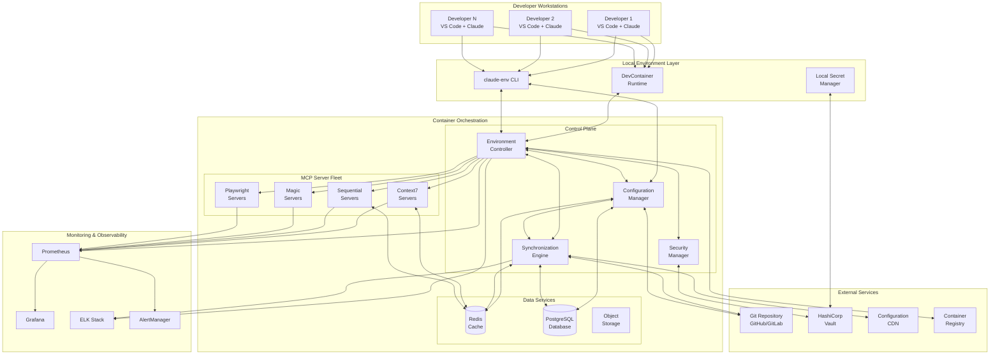
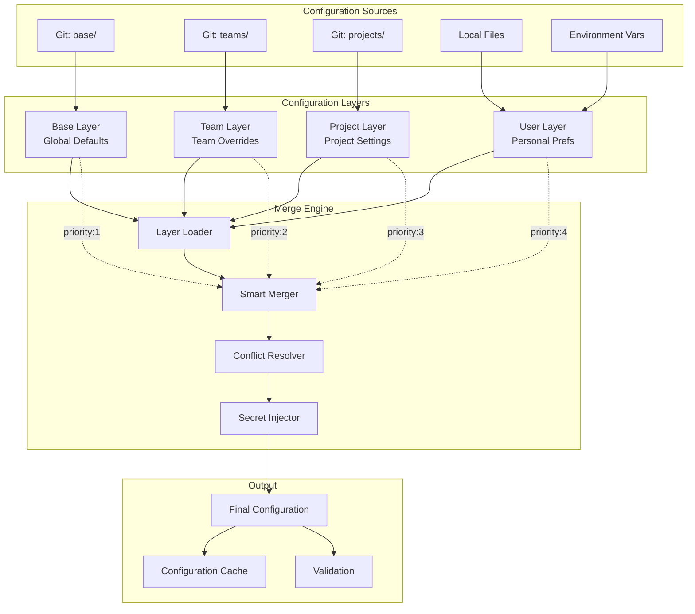
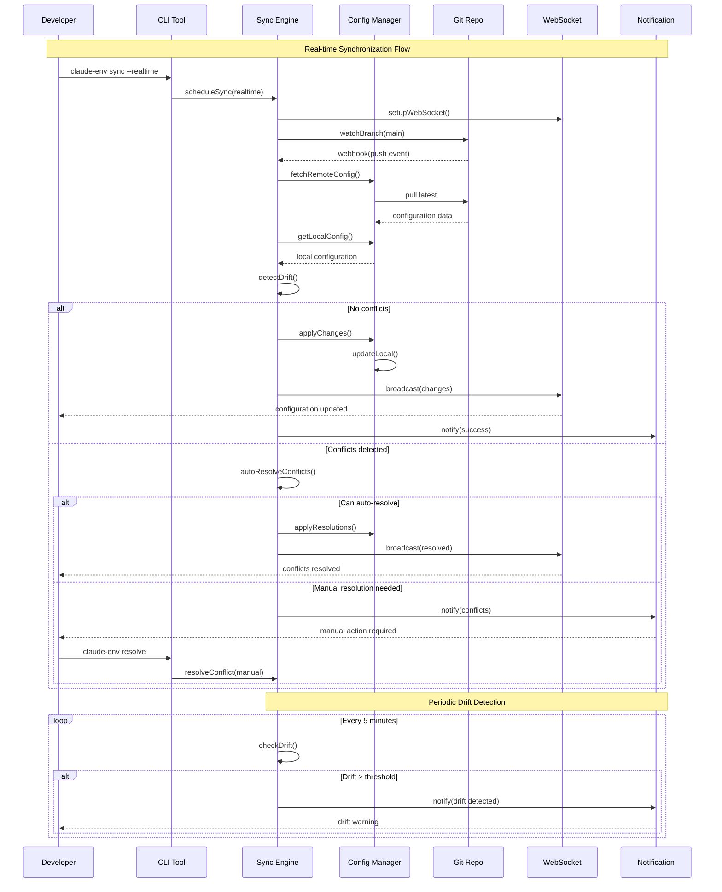
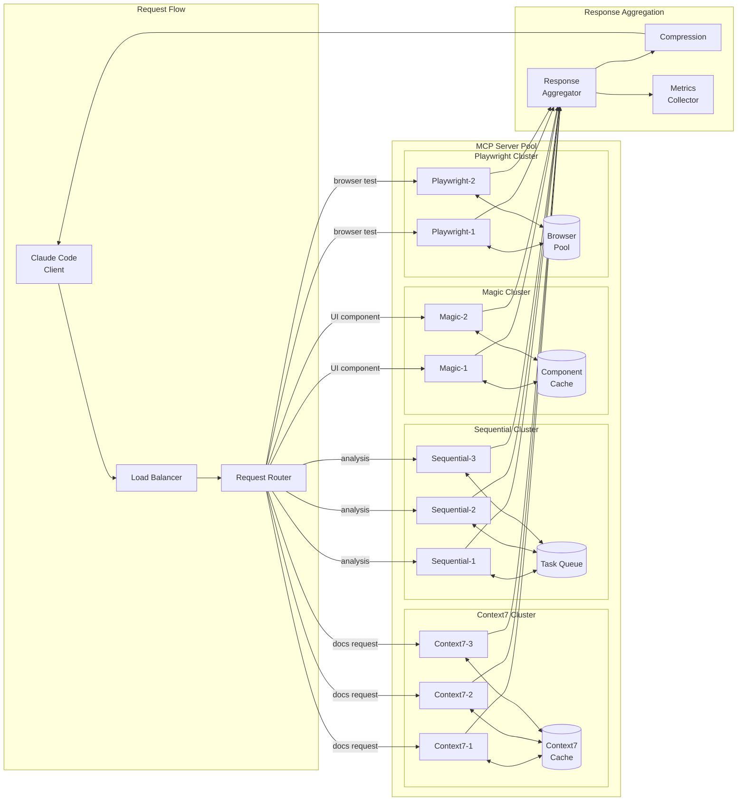
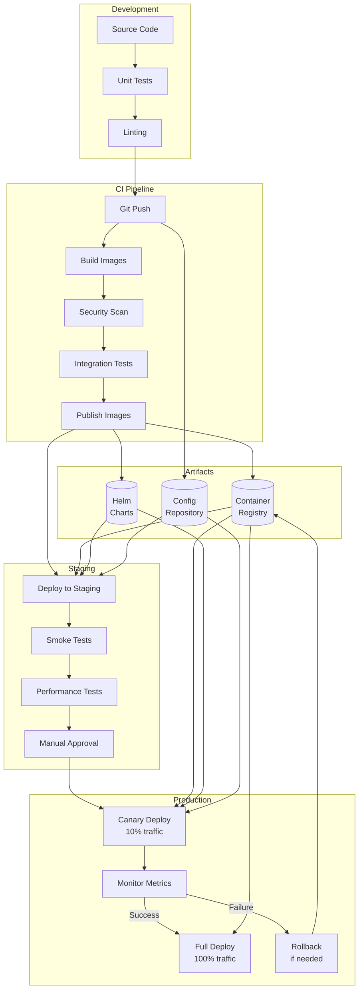
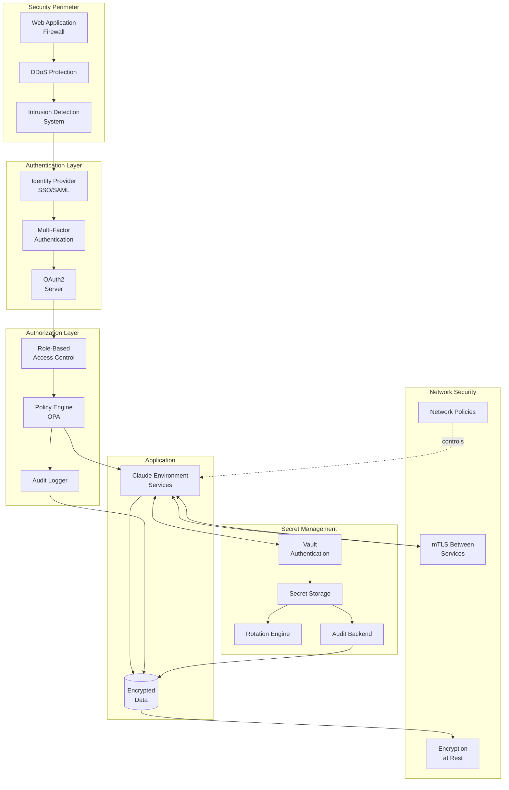
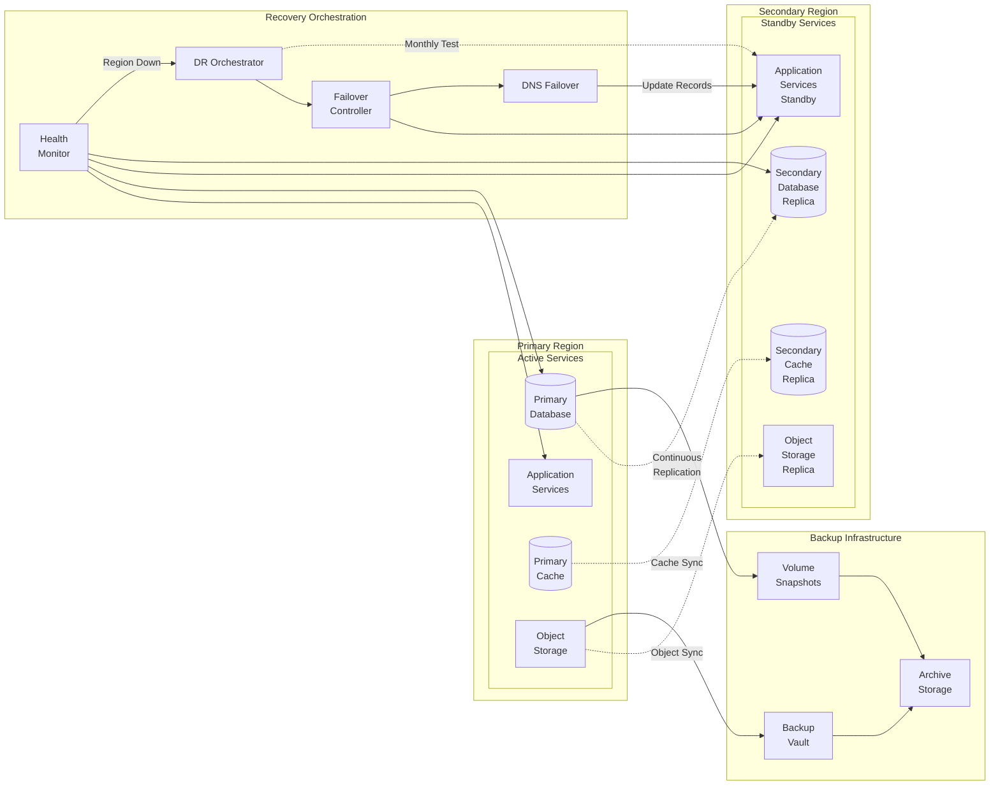
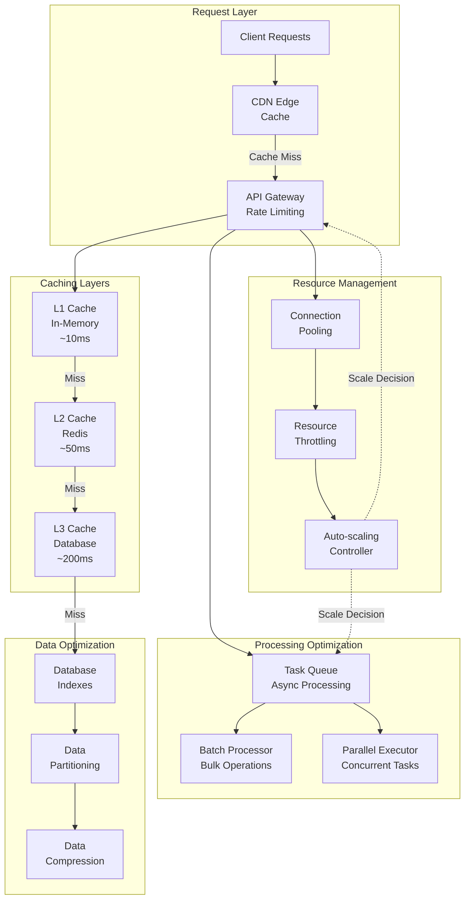

# Complete System Architecture Diagrams

## High-Level System Architecture

## Configuration Layer Architecture

## Synchronization Flow

## MCP Server Communication Architecture

## Deployment Pipeline Architecture

## Security Architecture

## Disaster Recovery Architecture

## Performance Optimization Architecture

